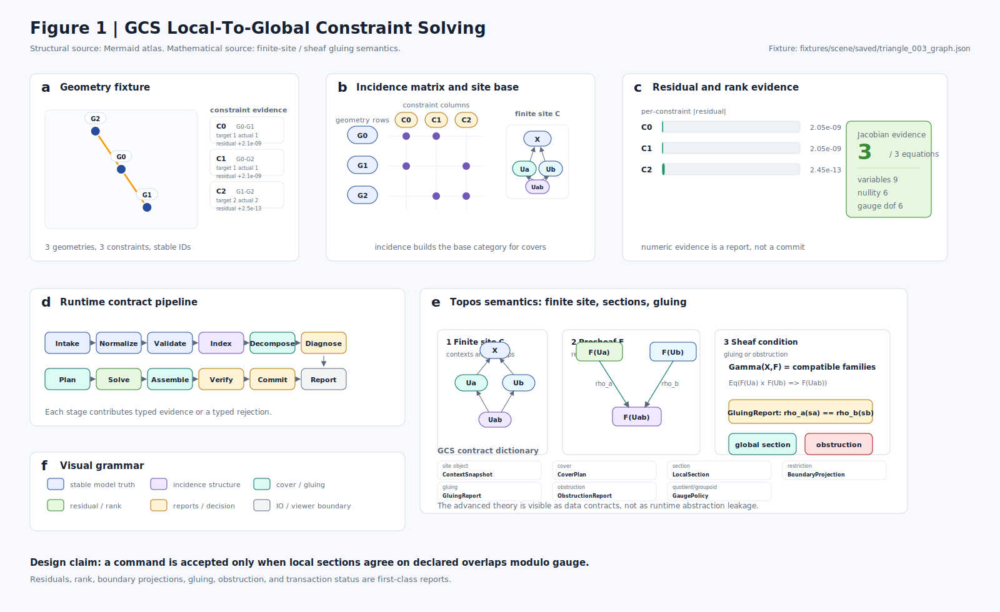

# GCS

GCS is a geometric constraint solving workspace. The repository is now arranged
around the target architecture vocabulary and a C++23 modules build.

## Researcher Route

The primary near-term audience is solver and geometric-constraint researchers.
Start here if you want to inspect what GCS can currently prove:

1. Read the active narrative map:
   [`docs/architecture/95-gcs-narrative-map.md`](docs/architecture/95-gcs-narrative-map.md).
2. Run the D1 CLI smoke demo:
   [`docs/product/demos/d1-cli-smoke/`](docs/product/demos/d1-cli-smoke/).
3. Run the D2 diagnostic classifier:
   `python tools\product_demo\diagnostic_classification.py`.
4. Inspect D3 replay evidence:
   [`docs/product/demos/d3-replay-evidence/`](docs/product/demos/d3-replay-evidence/).
5. Run the D3 replay checker:
   `python tools\product_demo\replay_evidence_check.py`.
6. Inspect the D5 static Solver Evidence Workbench package:
   [`docs/product/demos/d5-solver-evidence-workbench/`](docs/product/demos/d5-solver-evidence-workbench/).
7. Review B1 expected outputs and B2 candidate decisions:
   [`docs/architecture/benchmarks/b1-diagnostic-classification/`](docs/architecture/benchmarks/b1-diagnostic-classification/).
   [`docs/architecture/benchmarks/b2-microbenchmark-candidate-review.md`](docs/architecture/benchmarks/b2-microbenchmark-candidate-review.md).
8. Check the R1 researcher preview:
   [`docs/product/releases/r1-researcher-preview-20260526.md`](docs/product/releases/r1-researcher-preview-20260526.md).
9. Use the contribution boundary before proposing changes:
   [`docs/product/researcher-contribution-boundary.md`](docs/product/researcher-contribution-boundary.md).

GCS is not claiming production CAD readiness or benchmark superiority. Its
current public-facing value is inspectable solver evidence: fixtures,
diagnostics, replay reports, expected outputs, and task archives.

## Architecture



The architecture source of truth lives in
[`docs/architecture`](docs/architecture/README.md). The editorial figure above
is generated from
[`tools/architecture_visualization/render_gcs_figure1.py`](tools/architecture_visualization/render_gcs_figure1.py)
and documented in the
[`GCS Architecture Atlas`](docs/architecture/70-visualization/gcs-architecture-atlas.md).

## Repository Layout

| Path | Purpose |
| --- | --- |
| `src/gcs/kernel` | Domain model, stable IDs, behavior intent, and type helpers. |
| `src/gcs/incidence_graph` | Current connected-component decomposition prototype. |
| `src/gcs/diagnostics` | Current DOF/status/residual diagnostics prototype. |
| `src/gcs/numeric_engine` | Current numeric solving prototype. |
| `src/gcs/io_adapters` | Text and JSON scene import/export. |
| `src/gcs/session_runtime` | Temporary orchestration facade over the current solver modules. |
| `apps/gcs_cli` | Thin command-line executable entry point. |
| `python/gcs_viz` | Local Python visualization application. |
| `fixtures/scene` | Reproducible text and JSON scene inputs. |
| `scripts` | Repository automation and launch scripts. |
| `docs/architecture` | Durable architecture source of truth. |
| `docs/research` | Background research notes and exploratory material. |

The current C++ implementation still contains prototype logic from the old
`core/dcm/lgs/cds/io/app` modules, but the physical layout now names the target
responsibilities. Future solver work should make the code match these
boundaries instead of reintroducing legacy project structure.

## Build

Use the Clang + Ninja CMake preset:

```bat
scripts\build_clang_ninja.cmd
```

The executable is generated at:

```text
out/build/clang-ninja/GCS.exe
```

The CLI defaults to `fixtures/scene/basic/g1.txt` when no scene path is passed:

```bat
out\build\clang-ninja\GCS.exe fixtures\scene\basic\g1.txt
```

## Python Viewer

Install Python dependencies when needed:

```bat
python -m pip install -r python\requirements.txt
```

Launch the local viewer:

```bat
scripts\start_gui.cmd
```

Set `GCS_EXE` if you want the viewer to call a solver executable outside the
default CMake preset output path.

## Testing

Run the full local quality gate before pushing solver or architecture changes:

```bat
scripts\run_quality_gates.cmd
```

The gate wraps agentic design validation, dependency checks, Python scene tool
tests, CMake build, CTest contract suites, fixture-corpus checks, and a
representative CLI smoke run.

New tests should be designed around the target contracts in
`docs/architecture/30-contracts` and the verification scenes in
`fixtures/scene/verification`.
