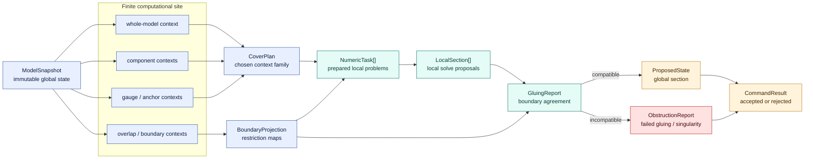
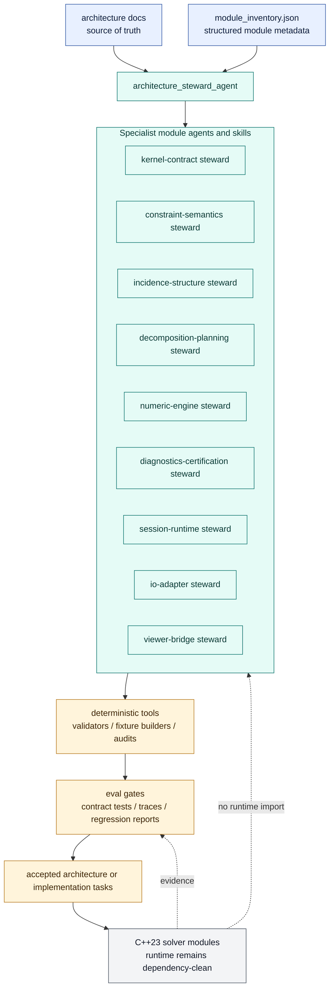

# GCS Architecture Atlas

Research snapshot: 2026-05-23.

This atlas turns the GCS architecture source of truth into a small set of
reviewable diagrams. The diagrams intentionally use Mermaid source instead of
bitmap art so they can be diffed, reviewed, searched, and later checked against
module metadata.

## Reading Rules

- Each diagram has one viewpoint and one reasoning task.
- Arrows in dependency diagrams point from a module to the module it imports or
  consumes.
- Arrows in pipeline diagrams point in runtime/data-flow order.
- Dotted edges are evidence, reports, read-only projection, or design feedback;
  they are not lower-layer runtime dependencies.
- Contract names are more important than implementation nicknames.

## Visual Grammar

| Visual token | Meaning |
| --- | --- |
| Blue node | Durable domain truth: IDs, snapshots, contexts, reports. |
| Teal node | Mathematical analysis or solving. |
| Amber node | Runtime orchestration and transaction boundary. |
| Gray node | IO, viewer, CLI, tests, or support boundary. |
| Red node | obstruction, rejection, failure, or unsupported path. |
| Solid arrow | Runtime flow or allowed import/consumption. |
| Dotted arrow | Report, evidence, read-only projection, or design overlay. |

## Editorial Figure 1

The Mermaid diagrams in this atlas remain the structural source of truth. The
SVG below is the editorial artifact intended for high-signal architecture
communication. Rather than creating a separate abstract mathematics figure,
Figure 1 upgrades the main architecture diagram so the engineering pipeline and
the finite-site/sheaf-gluing interpretation are visible on the same canvas. It
combines a real fixture-derived geometry panel, an incidence matrix and site
base, residual/rank/gauge evidence, the runtime pipeline, and a topos semantics
panel mapping site objects, covers, sections, restrictions, gluing,
obstructions, and gauge quotients to concrete GCS contracts.


Generated assets:

- `assets/figure1-gcs-local-to-global.svg`
- `assets/figure1-panel-a-geometry.svg`
- `assets/figure1-panel-b-incidence.svg`
- `assets/figure1-panel-c-residual-rank.svg`

Design controls:

- Design controls live in
  `tools/architecture_visualization/figure1.theme.json` and
  `tools/architecture_visualization/figure1.layout.json`.
- Inkscape round-trip editing is documented in
  [`svg-editing-workflow.md`](svg-editing-workflow.md).

Rebuild command:

```powershell
$env:PYTHONDONTWRITEBYTECODE='1'
python tools\architecture_visualization\render_gcs_figure1.py --fixture fixtures\scene\saved\triangle_003_graph.json --out-dir docs\architecture\70-visualization\assets
```

Figure 1 should be updated when the structural source changes in one of these
ways:

- the target runtime pipeline gains, removes, or renames a stage;
- decomposition changes the meaning of contexts, overlaps, boundary variables,
  or gluing;
- diagnostics changes the residual, rank, DOF, obstruction, or transaction
  evidence that makes a command acceptable;
- the fixture corpus gains a better canonical local-to-global example.

## Editorial Aesthetic Direction

The Figure 1 aesthetic should follow a Claude-influenced scientific editorial
style:

- warm paper and panel surfaces, not sterile white UI chrome;
- near-black text with warm gray secondary labels;
- sparse semantic accents instead of saturated default diagram colors;
- serif-capable figure title with restrained sans-serif labels;
- flat surfaces, thin borders, and limited radius;
- no decorative gradients, orbs, or texture that does not encode information.

The visual goal is not to imitate Claude branding literally. It is to preserve
GCS' mathematical seriousness while using the same current design instincts:
quiet warmth, strong hierarchy, and design-system discipline.

## 1. System Landscape

Viewpoint: onboarding engineer or architecture reviewer.

Concern: understand what enters GCS, what owns durable truth, and which parts
are boundary consumers.

```mermaid
flowchart LR
    user["Human designer / engineer"]
    fixtures["Fixture corpus<br/>verification scenes"]
    tests["Contract tests<br/>GTest / CTest"]
    cli["apps/gcs_cli<br/>thin executable shell"]
    gui["python/gcs_viz<br/>local viewer app"]

    subgraph boundary["Boundary adapters"]
        io["io_adapters<br/>scene schema / canonical IO"]
        viewer["viewer_bridge<br/>read-only projections"]
    end

    runtime["session_runtime<br/>commands / transactions / history"]

    subgraph core["GCS solver core"]
        kernel["kernel<br/>stable IDs / snapshots / contexts"]
        catalog["constraint_catalog<br/>residuals / Jacobians / DOF metadata"]
        graph["incidence_graph<br/>hypergraph / body graph / indices"]
        planner["decomposition_planner<br/>CoverPlan / BoundaryProjection"]
        numeric["numeric_engine<br/>NumericTask / LocalSection"]
        diag["diagnostics<br/>GluingReport / ObstructionReport"]
    end

    user --> gui
    user --> cli
    fixtures --> io
    tests -. contract evidence .-> core
    cli --> io
    cli --> runtime
    gui --> viewer
    io --> kernel
    runtime --> kernel
    runtime --> catalog
    runtime --> graph
    runtime --> planner
    runtime --> numeric
    runtime --> diag
    viewer -. observes .-> runtime
    viewer -. overlays .-> diag

    classDef domain fill:#e8f0ff,stroke:#3157a4,color:#0b1c3d;
    classDef solve fill:#e5fbf6,stroke:#0f766e,color:#063b35;
    classDef orchestrate fill:#fff4db,stroke:#b7791f,color:#402500;
    classDef boundary fill:#f3f4f6,stroke:#4b5563,color:#111827;
    class kernel domain;
    class catalog,graph,planner,numeric,diag solve;
    class runtime orchestrate;
    class io,viewer,cli,gui,fixtures,tests,user boundary;
```

Invariants:

- `kernel` is the durable truth boundary.
- `session_runtime` is the only full command orchestrator.
- `io_adapters` and `viewer_bridge` consume public contracts only.
- Tests assert contracts and reports, not private implementation details.

## 2. Module Dependency Topology

Viewpoint: C++23 module maintainer.

Concern: preserve dependency direction while the implementation deepens.

```mermaid
flowchart TB
    app["apps / GUI / tests"]
    io["io_adapters"]
    viewer["viewer_bridge"]
    runtime["session_runtime"]
    diag["diagnostics"]
    planner["decomposition_planner"]
    numeric["numeric_engine"]
    graph["incidence_graph"]
    catalog["constraint_catalog"]
    kernel["kernel"]

    catalog --> kernel
    graph --> kernel
    planner --> graph
    planner --> kernel
    numeric --> catalog
    numeric --> kernel
    diag --> numeric
    diag --> catalog
    diag --> graph
    diag --> kernel
    runtime --> planner
    runtime --> diag
    runtime --> numeric
    runtime --> catalog
    runtime --> graph
    runtime --> kernel
    io --> kernel
    viewer --> runtime
    viewer --> diag
    viewer --> kernel
    app --> io
    app --> runtime
    app --> viewer

    diag -. diagnostic hints .-> planner
    planner -. planned contexts .-> numeric
    numeric -. rank / residual evidence .-> diag

    classDef kernel fill:#e8f0ff,stroke:#3157a4,color:#0b1c3d;
    classDef math fill:#e5fbf6,stroke:#0f766e,color:#063b35;
    classDef orchestrate fill:#fff4db,stroke:#b7791f,color:#402500;
    classDef boundary fill:#f3f4f6,stroke:#4b5563,color:#111827;
    class kernel kernel;
    class catalog,graph,planner,numeric,diag math;
    class runtime orchestrate;
    class io,viewer,app boundary;
```

Invariants:

- Lower mathematical layers never import UI, IO, app lifecycle, or viewer code.
- Numeric success is evidence, not a commit.
- Diagnostics may explain planner and numeric results; the runtime decides
  whether a command is accepted.
- Any future cycle must be split into smaller contracts or report primitives.

## 3. Local-To-Global Semantic Map

Viewpoint: solver architect.

Concern: show the mathematical semantics behind decomposition, solving,
diagnostics, and commit.



Invariants:

- Decomposition is cover selection, not a private optimization trick.
- Assembly is gluing over declared overlaps, not coordinate concatenation.
- Gauge fixing selects representatives; it must not silently erase degrees of
  freedom.
- Failed gluing produces an obstruction report with stable IDs.

## 4. Runtime Contract Pipeline

Viewpoint: runtime and quality engineer.

Concern: every command must produce state plus evidence, or a specific typed
rejection.

```mermaid
flowchart LR
    intake["1 Intake<br/>file / API / UI command"]
    normalize["2 Normalize<br/>units / IDs / typed entities"]
    validate["3 Validate<br/>model reports"]
    index["4 Index<br/>incidence structures"]
    decompose["5 Decompose<br/>contexts / overlaps"]
    diagnose1["6 Diagnose<br/>DOF / rank hints"]
    plan["7 Plan<br/>CoverPlan / gauge policy"]
    solve["8 Solve<br/>NumericTask -> LocalSection"]
    assemble["9 Assemble<br/>GluingReport"]
    verify["10 Verify<br/>residual / reliability"]
    commit["11 Commit or reject<br/>state version"]
    report["12 Report<br/>user/API/fixture explanation"]

    reports["StageReport bundle<br/>validation / decomposition / numeric / diagnostics"]
    reject["Specific rejection<br/>invalid / unsupported / inconsistent / singular"]

    intake --> normalize --> validate --> index --> decompose --> diagnose1 --> plan --> solve --> assemble --> verify --> commit --> report
    validate -.-> reports
    decompose -.-> reports
    diagnose1 -.-> reports
    solve -.-> reports
    assemble -.-> reports
    verify -.-> reports
    reports -.-> report
    validate -->|fatal| reject
    plan -->|unsupported| reject
    assemble -->|obstruction| reject
    verify -->|not reliable| reject
    reject --> report

    classDef domain fill:#e8f0ff,stroke:#3157a4,color:#0b1c3d;
    classDef solve fill:#e5fbf6,stroke:#0f766e,color:#063b35;
    classDef orchestrate fill:#fff4db,stroke:#b7791f,color:#402500;
    classDef fail fill:#fee2e2,stroke:#b91c1c,color:#450a0a;
    class intake,normalize,validate,index domain;
    class decompose,diagnose1,plan,solve,assemble,verify solve;
    class commit,report,reports orchestrate;
    class reject fail;
```



Invariants:

- A command is not accepted until post-solve verification and gluing pass.
- Every stage contributes a structured report.
- The smallest known responsible entity, constraint, context, or boundary
  should be named on failure.
- Rejected commands preserve the previous durable state version.

## 5. Agentic Design Overlay

Viewpoint: architecture steward and future module agents.

Concern: show how AI-assisted design work is governed without entering solver
runtime dependencies.



Invariants:

- Agents, prompts, traces, and skills are a maintenance overlay.
- Solver modules never import agentic infrastructure.
- Module agents produce structured design reports, not prose-only advice.
- Evals and contract tests are the acceptance gate for generated work.

## 6. Module Maturity Lens

Viewpoint: implementation planner.

Concern: choose the next work by contract maturity and blast radius.

| Module | Current architecture maturity | Next visualization cue |
| --- | --- | --- |
| `kernel` | L2 | Highlight stable IDs, context validation, report registry. |
| `constraint_catalog` | L1-L2 | Show residual/Jacobian ownership and degeneracy reports. |
| `incidence_graph` | L1-L2 | Show hypergraph, reverse indices, body graph, separators. |
| `decomposition_planner` | L1 | Show coverage, overlaps, boundary projections, gauge, solve DAG. |
| `numeric_engine` | L1 | Show `NumericTask`, residual assembly, rank/condition, iteration trace. |
| `diagnostics` | L1-L2 | Show phase-specific DOF/rank/residual/gluing/obstruction evidence. |
| `session_runtime` | L2 | Show transaction boundary, rollback, replay, post-commit verification. |
| `io_adapters` | L1 | Show schema registry, migration, canonical output, round-trip diff. |
| `viewer_bridge` | L1 | Show read-only projection, overlays, command drafts, hit-test mapping. |
| `contract_tools` | L1 | Show fixture provenance, invariant checks, dependency audits. |

## Diagram Maintenance Rules

- Add new diagrams only when they answer a distinct concern.
- Keep Mermaid node IDs stable when possible; change labels freely as the
  architecture language improves.
- If code imports diverge from Diagram 2, fix either code or diagram in the
  same PR.
- If a pipeline stage gains a new report, update Diagram 4 and the quality
  acceptance gates together.
- Do not add UI, IO, file path, process-launch, or visualization policy to
  lower solver layers to make a diagram simpler.
