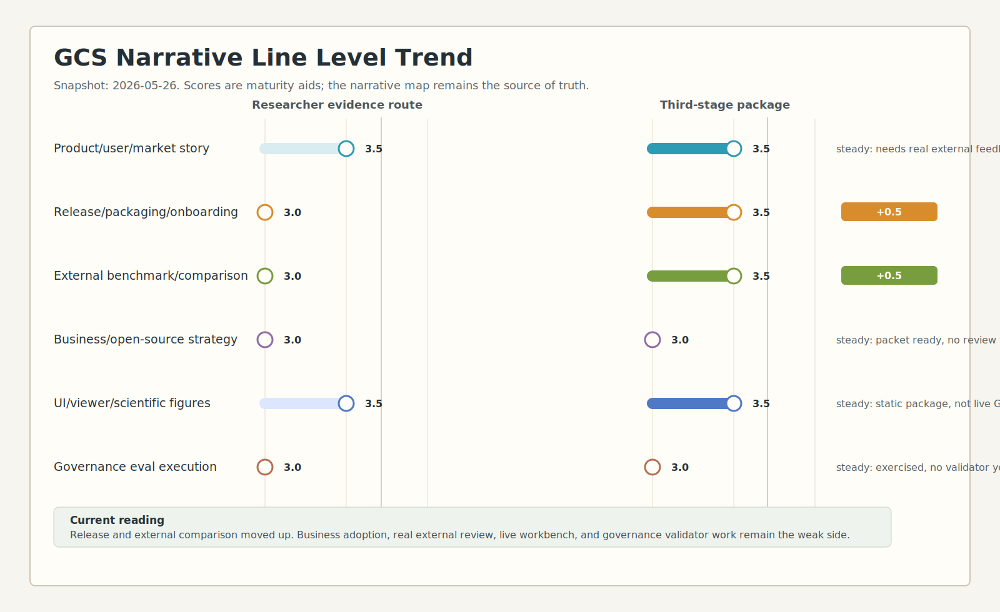

# Narrative Line Level Trend

Status: active
Date: 2026-05-26
Figure: `figure95-narrative-line-level-trend-20260526`

## Purpose

This trend note compares the weak-axis narrative levels after the researcher
evidence-route batch and after the third-stage evidence package.

It is a maturity trend, not a statistical measurement. The source of truth
remains `docs/architecture/95-gcs-narrative-map.md`.

## Artifacts

- Source spec:
  `tools/architecture_visualization/specs/figure95-narrative-line-level-trend-20260526.yaml`
- SVG trend:
  `docs/architecture/70-visualization/assets/figure95-narrative-line-level-trend-20260526.svg`

## Trend Reading

| Narrative line | Researcher evidence route | Third-stage package | Reading |
| --- | ---: | ---: | --- |
| Product/user/market story | 3.5 | 3.5 | Strong evidence route exists; true external feedback is still missing. |
| Release/packaging/onboarding | 3.0 | 3.5 | D3 replay checker strengthens R2 readiness, but reproducible build transcript is still missing. |
| External benchmark/comparison | 3.0 | 3.5 | Feasibility matrix and B2 review separate evidence from overclaiming; no external executable run yet. |
| Business/open-source strategy | 3.0 | 3.0 | Review packet exists, but actual external review or contribution is still needed. |
| UI/viewer/scientific figures | 3.5 | 3.5 | D5 static package strengthens the story without changing live-GUI maturity. |
| Governance eval execution | 3.0 | 3.0 | Eval seeds now have exercised evidence, but no validator candidate exists yet. |

## Next Strengthening Targets

1. Add an R2 reproducible build transcript.
2. Build an E-GOV-001 validator candidate.
3. Convert the first researcher review packet into a real external review
   archive.
4. Add B2 expected-output files for B2-01 and B2-02.
5. Make D5 a live workbench walkthrough only after viewer evidence projection
   is ready.
