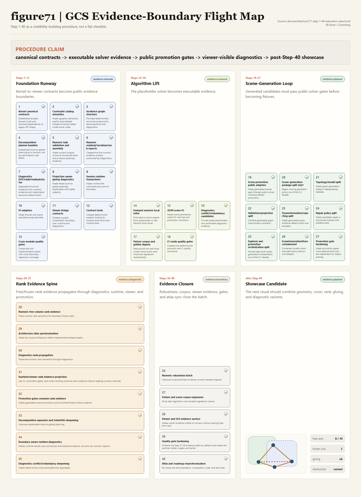

# Step 1-40 Execution Report

Snapshot date: 2026-05-24.

This report is a review and reporting view over the implementation roadmap.
The execution source of truth remains
`docs/architecture/66-implementation-execution-roadmap.md`; the detailed
forward plan for Steps 31 through 40 remains
`docs/architecture/68-forward-execution-plan-2026-05-24.md`.

## Executive Summary

Steps 1 through 40 are completed and pushed. They established the C++23 module
solver architecture, contract-tested kernel-to-viewer boundaries, JSON IO,
CI-ready quality gates, scene-generation promotion tooling, free-column rank
evidence, diagnostics propagation, runtime/viewer rank evidence projection,
promotion rank-evidence gates, SolveDAG boundary dependency evidence,
post-local runtime diagnostics, diagnostics conflict/redundancy
responsible-set deepening, numeric robustness improvements, reusable
boundary/tolerance/separator fixtures, structured viewer evidence surfaces,
the architecture atlas, hardened public-evidence quality gates, and a
resynchronized Step 1-40 reporting/visualization system.

The post-Step-40 showcase graph is now the next candidate. Its theme is to put
the completed public evidence chain onto one reusable constraint graph rather
than starting another abstract documentation batch.

Current baseline:

| Field | Value |
| --- | --- |
| Branch | `codex-e001-executable-closure-tooling` |
| Current completed step | Step 40 |
| Next implementation step | Integrated feature showcase constraint graph candidate |
| Default gate | `python tools\agentic_design\agentic_toolkit.py run-quality-gates` |
| Contract test baseline | 100 CTest-discovered GTest cases |
| Post-Step-40 candidate | Integrated feature showcase constraint graph |

## Procedure Figure

This figure groups Steps 1 through 40 by evidence boundary rather than showing
them as a flat checklist: foundation contracts, executable solver evidence,
scene-generation promotion gates, rank-evidence propagation, the next batch,
and the post-Step-40 showcase candidate.

The displayed artifact is now the browser-rendered review PNG from the
production pipeline. The editable source remains the HTML/CSS compositor
output:
[`figure71-gcs-step-1-40-evidence-map.html`](70-visualization/assets/figure71-gcs-step-1-40-evidence-map.html).
Review exports are also available as
[`PDF`](70-visualization/assets/figure71-gcs-step-1-40-evidence-map.review.pdf)
and manifest evidence in
[`figure71-gcs-step-1-40-browser-export.json`](70-visualization/assets/figure71-gcs-step-1-40-browser-export.json),
with structural QA recorded in
[`figure71-gcs-step-1-40-evidence-map.qa.json`](70-visualization/assets/figure71-gcs-step-1-40-evidence-map.qa.json).

The older coordinate-drawn
[`figure71-gcs-step-1-40-evidence-map.svg`](70-visualization/assets/figure71-gcs-step-1-40-evidence-map.svg)
is retained only as a historical prototype.

## Step Report

| Step | Status | Focus | Core Information | Reporting Value / Evidence |
| --- | --- | --- | --- | --- |
| 1 | Done | Kernel canonical contracts | Canonicalized `gcs.kernel`, stable IDs, immutable snapshots, contexts, reports, deltas, and validation contracts. | Established durable domain truth and removed dependence on legacy API shape. |
| 2 | Done | Constraint catalog semantics | Added constraint definitions, entity signatures, scalar schemas, residual evaluators, Jacobian contracts, finite-difference checks, and degeneracy reports. | Made equation semantics explicit and testable instead of being hidden inside solver code. |
| 3 | Done | Incidence graph structure | Upgraded incidence hypergraph, reverse indices, rigid-body projection, connected components, malformed-edge reports, graph dumps, and reusable fixture builders. | Provided deterministic structural evidence for decomposition and diagnostics. |
| 4 | Done | Decomposition planner baseline | Added cover validation, boundary projections, coverage proof, solve-order validation, and unsupported-plan evidence. | Established local-to-global planning as a contract, not an optimization side effect. |
| 5 | Done | Numeric task validation and assembly | Added `NumericTaskValidationReport`, equation assembly, residual ordering, variable ordering, and missing-ID negative tests. | Made numeric engine consume structured tasks and produce assembly evidence. |
| 6 | Done | Numeric residual/Jacobian/rank reports | Added residual reports, Jacobian reports, rank/condition reports, boundary evidence, and replayable traces. | Created the first numeric evidence surface consumed by diagnostics. |
| 7 | Done | Diagnostics DOF/rank/residual/status | Added diagnostic phases, DOF analysis, residual promotion, rank evidence, status precedence, and typed conflict/redundancy placeholders. | Separated structural evidence from numeric evidence and made status decisions deterministic. |
| 8 | Done | Projection-aware gluing diagnostics | Added boundary agreement reports, projection IDs, gluing obstruction reports, and boundary mismatch conflicts. | Made failed local-to-global assembly explainable with stable subjects. |
| 9 | Done | Session runtime transactions | Added command validation, transaction trace, rollback, history, replay, and state-version semantics. | Made runtime the command and commit boundary. |
| 10 | Done | IO adapters | Added schema registry, canonical text/JSON paths, parser/migration reports, round-trip diffs, and deterministic digests. | Made fixtures and scene persistence reproducible. |
| 11 | Done | Viewer bridge contracts | Added read-only scene projection, diagnostic overlays, command drafts, and history frame projections. | Created a public visualization boundary over runtime and diagnostics. |
| 12 | Done | Contract tools | Split fixture provenance, invariant checks, dependency audits, and golden report tooling into reusable contract tools. | Created deterministic support tooling for module-level and cross-module tests. |
| 13 | Done | Cross-module quality gates | Added cross-module quality contracts, broader negative corpus, rollback evidence, parse evidence, and viewer propagation checks. | Closed the first implementation batch with cross-boundary regression coverage. |
| 14 | Done | Damped numeric local solve | Replaced identity local solve with dense damped Gauss-Newton, damping validation, trust clamp, boundary freezing, and convergence traces. | Promoted numeric engine from placeholder to real iterative local solver. |
| 15 | Done | JSON scene IO | Added readable JSON schema path, bounded parser, legacy migration, malformed JSON corpus, and JSON round trip. | Made scene persistence useful for real test and promotion workflows. |
| 16 | Done | Diagnostics conflict/redundancy candidates | Promoted residual conflicts and over-constrained redundancy candidates into public diagnostic tools. | Turned typed placeholders into actionable diagnostic evidence. |
| 17 | Done | Fixture corpus and golden digests | Expanded under/over-constrained, redundant, inconsistent, singular, and gluing-obstruction fixtures plus golden summaries. | Reduced ad hoc test-local model construction and improved regression explainability. |
| 18 | Done | CI-ready quality gates | Added `run-quality-gates`, Windows wrappers, agentic validation, Python scene tests, CMake build, CTest, fixture-corpus checks, and CLI smoke. | Created one deterministic pre-push and CI-quality command. |
| 19 | Done | Scene promotion public adapters | Connected generated candidates to public IO, kernel, runtime, diagnostics, and viewer gates; wrote `public_scene.gcs.json`. | Made generated scenes pass through public solver contracts before promotion. |
| 20 | Done | Scene-generation package split start | Extracted scene-generation `contracts`, `storage`, and `promotion` modules while keeping `tools.py` as facade. | Began moving generator policy out of the CLI facade. |
| 21 | Done | Topology/model split | Extracted topology and GCS model helpers: edge canonicalization, components, BCC evidence, rigid-set rebuilding, and invariant checks. | Made graph generation helpers independently testable. |
| 22 | Done | Validation/projection split | Extracted generated graph validation and projection builders with invalid-signature and projection-shape tests. | Clarified generated graph input/output contracts. |
| 23 | Done | Parameterization/reporting split | Extracted deterministic layout, geometry values, scalar assignment, graph summaries, histograms, and reporting helpers. | Made generated scene evidence deterministic and reusable. |
| 24 | Done | Repair policy split | Extracted repair policy for signature replacement, rigid-set recoloring, biconnectivity repair, and structured edit lists. | Made candidate repair a structured module with testable edits. |
| 25 | Done | Explorer and promotion orchestration split | Extracted exploration request normalization, candidate gates, coverage scoring, negative evidence, promotion package assembly, and blocking rules. | Moved high-level scene-generation orchestration out of the CLI facade. |
| 26 | Done | SceneGenerationStore containment | Added `SceneGenerationStore` for store paths, graph IO, IDs, roots, trace append, and digests; routed explorer and promotion through it. | Contained scratch-store and path policy behind one adapter. |
| 27 | Done | Promotion gate hardening | Added structured runtime report inputs and preferred structured runtime/diagnostics evidence before executable smoke fallback. | Made promotion gates more deterministic and less dependent on stdout parsing. |
| 28 | Done | Numeric free-column rank evidence | Added `free_variable_dimension` and `frozen_variable_dimension`; computed rank/nullity over free Jacobian columns after boundary freezing. | Fixed numeric rank semantics for boundary-frozen tasks. |
| 29 | Done | Architecture atlas synchronization | Updated atlas and Figure 1 with scene-generation promotion boundaries, contract tools, and free/frozen rank evidence. | Made the visual architecture reflect implemented evidence paths. |
| 30 | Done | Diagnostics rank propagation | Added free/frozen numeric dimensions to `diagnostics::RankReport` and boundary-frozen diagnostics coverage. | Preserved numeric rank semantics through diagnostics. |
| 31 | Done | Runtime/viewer rank evidence projection | Added `runtime::RankEvidenceProjection`, runtime command-result projection, viewer overlay evidence, viewer summary evidence, and accepted/boundary-frozen contract tests. | Lets UI, promotion gates, and review tooling consume rank evidence without reading numeric internals. |
| 32 | Done | Promotion gates consume rank evidence | Added a first-class `rank_evidence` gate over public runtime/viewer rank projections with pass, skipped, and malformed-evidence tests. | Makes generated scene promotion prove full/free/frozen/nullity evidence. |
| 33 | Done | Decomposition separator and SolveDAG deepening | Added `SolveDag` structures, DAG validation reports, boundary projection dependency edges, and accepted/backward-dependency contract tests. | Improves explainable local-to-global planning. |
| 34 | Done | Boundary-aware runtime diagnostics | Added `PostLocalDiagnosticReport`, `CommandResult.post_local_diagnostics`, post-local stage traces, and diagnostics-first rank projection. | Makes runtime results carry structured rank/residual evidence, not only raw numeric reports. |
| 35 | Done | Diagnostics conflict/redundancy deepening | Added residual conflict entity subjects and exact duplicate distance redundancy evidence while preserving over-constrained fallback and status precedence. | Makes failed solves more actionable and reportable. |
| 36 | Done | Numeric robustness batch | Convergence now uses max-absolute residual tolerance and singular free-Jacobian evidence no longer publishes finite condition estimates. | Improves trustworthiness of dense numeric baseline reports. |
| 37 | Done | Fixture and scene corpus expansion | Added reusable boundary-frozen, tolerance-edge, and separator-chain contract-tool fixtures and promoted tolerated residual evidence into the corpus. | Gives later algorithm work durable regression scenes. |
| 38 | Done | Viewer and GUI evidence surface | Added structured residual, conflict, redundancy, and obstruction projections to viewer overlays and summaries while preserving rank evidence. | Makes solver evidence visible to humans without parsing free-form text. |
| 39 | Done | Quality gate hardening | Added `python.agentic_toolkit` and `ctest.public_evidence_chain` while preserving full CTest and fixture-corpus gates. | Protects the Step 31-38 evidence paths by default and makes the sentinel visible in gate summaries. |
| 40 | Done | Atlas and roadmap resynchronization | Added Figure 71 to the atlas, promoted the visual taste guide, updated maturity status, regenerated the Step 1-40 figure, and closed the roadmap batch. | Re-closes the documentation, visualization, code, and test loop. |

## Reporting Themes

| Theme | Steps | Message |
| --- | --- | --- |
| Canonical C++23 solver foundation | 1-13 | The solver now has contract-tested kernel, catalog, graph, planner, numeric, diagnostics, runtime, IO, viewer, contract tools, and quality boundaries. |
| Algorithm and IO deepening | 14-18 | Numeric solving, JSON IO, diagnostics candidates, fixture corpus, and CI gates moved from scaffolding into executable contracts. |
| Scene-generation and promotion architecture | 19-27 | Generated scenes now flow through structured package modules, store adapters, public solver artifacts, and hardened promotion gates. |
| Rank evidence correctness | 28-31 | Rank/nullity now respect boundary-frozen variables and propagate from numeric engine to diagnostics, runtime, and viewer projections. |
| Public evidence boundary batch | 39-40 | Step 39 hardened quality gates; Step 40 resynchronized the atlas, roadmap, report, and next candidate. |

## Post-Step-40 Showcase Candidate

After Step 40, the planned showcase is an integrated feature constraint graph
that demonstrates:

- multiple rigid sets;
- meaningful separator or overlap structure;
- boundary-frozen variables and full/free/frozen rank evidence;
- satisfied and negative diagnostic variants;
- promotion through public IO/runtime/diagnostics/viewer gates;
- viewer or atlas-ready projection for demos and reports.

This showcase should enter the fixture or generated-scene corpus with
structured expectations. It should not remain a manual scratch artifact.
