# Step 1-49 Execution Overview

Snapshot date: 2026-05-24.

This overview combines the earlier Step 1-40 report, the Step 41-46 report,
the Step 47 runtime replay evidence export closure, the Step 48 consumer path,
and the Step 49 saved report artifact. It is a briefing map, not the source of
truth. The authoritative
execution records remain:

- `66-implementation-execution-roadmap.md`;
- `67-current-progress-and-next-steps.md`;
- `68-forward-execution-plan-2026-05-24.md`;
- `71-step-1-40-execution-report.md`;
- `79-step-41-46-execution-report.md`.

## Main Claim

Steps 1 through 49 form one evidence program:

```text
contracts -> executable solver -> promotion gates -> viewer diagnostics
  -> integrated showcase -> scene compatibility -> replay-domain separation
  -> deterministic runtime replay evidence export -> public replay report
  -> saved replay evidence artifact
```

## Overview Diagram

```mermaid
flowchart LR
    s1["Steps 1-13<br/>canonical C++23 contracts"]
    s2["Steps 14-18<br/>numeric/IO/diagnostics/gates"]
    s3["Steps 19-27<br/>scene-generation promotion"]
    s4["Steps 28-35<br/>rank and responsibility evidence"]
    s5["Steps 36-40<br/>robustness, corpus, viewer, atlas closure"]
    s6["Steps 41-46<br/>showcase scene and replay boundaries"]
    s47["Step 47<br/>runtime replay evidence export"]
    s48["Step 48<br/>consumer path"]
    s49["Step 49<br/>saved report artifact"]
    s50["Step 50<br/>workflow review"]

    s1 --> s2 --> s3 --> s4 --> s5 --> s6 --> s47 --> s48 --> s49 --> s50

    s1 -. "stable IDs / snapshots / reports" .-> evidence["public evidence chain"]
    s2 -. "residuals / rank / fixture corpus" .-> evidence
    s3 -. "public scene gates" .-> evidence
    s4 -. "free/frozen rank projections" .-> evidence
    s5 -. "quality sentinel and atlas" .-> evidence
    s6 -. "scene history != runtime replay" .-> evidence
    s47 -. "deterministic transaction report export" .-> evidence
    s48 -. "viewer adapter + CLI replay report" .-> evidence
    s49 -. "saved replay evidence artifact" .-> evidence

    evidence -. "CTest sentinel, CLI smoke, Python tools" .-> gates["quality gates"]

    classDef domain fill:#e8f0ff,stroke:#3157a4,color:#0b1c3d;
    classDef solve fill:#e5fbf6,stroke:#0f766e,color:#063b35;
    classDef evidence fill:#fff4db,stroke:#b7791f,color:#402500;
    classDef boundary fill:#f3f4f6,stroke:#4b5563,color:#111827;
    classDef next fill:#f3ddd7,stroke:#a94c43,color:#450a0a;
    class s1 domain;
    class s2,s3,s4 solve;
    class s5,s6,s47,s48,s49,evidence,gates evidence;
    class s50 next;
```



## Figure Asset

The layout-aware overview artifact is Figure 73:

- HTML/CSS figure:
  `70-visualization/assets/figure73-gcs-step-1-46-evidence-closure-map.html`
- Structural QA:
  `70-visualization/assets/figure73-gcs-step-1-46-evidence-closure-map.qa.json`
- Semantic spec:
  `tools/architecture_visualization/specs/figure73.yaml`

Regeneration commands:

```powershell
python -B tools\architecture_visualization\figure71_html_compositor.py --spec tools\architecture_visualization\specs\figure73.yaml
python -B tools\architecture_visualization\figure_qa.py --figure figure73
```

## Step Group Summary

| Range | Group | Durable Evidence |
| --- | --- | --- |
| 1-13 | Contract foundation | C++23 modules, strong structured IO, module contract tests, kernel-to-viewer boundary vocabulary. |
| 14-18 | Executable baseline | Damped local solve, JSON IO, diagnostics candidates, fixture corpus, and CI-ready quality gate. |
| 19-27 | Scene promotion | Generated scene package split, store containment, public IO/runtime/diagnostics/viewer gates. |
| 28-35 | Evidence propagation | Free/frozen rank semantics, runtime/viewer projections, promotion rank gate, SolveDAG, post-local diagnostics, conflict/redundancy subjects. |
| 36-40 | Closure | Numeric robustness, reusable fixtures, viewer evidence surfaces, public evidence sentinel, atlas/report synchronization. |
| 41-46 | Showcase and replay | Integrated showcase fixture, JSON scene promotion, Figure 72, Python/C++ behavior compatibility, scene history replay tests, runtime replay boundary. |
| 47 | Runtime replay evidence export | Structured runtime report export for command traces, ordered stages, state versions, report codes, and missing-command evidence without JSON scene `history` writes. |
| 48 | Runtime replay evidence consumer | Viewer/report adapter summary plus CLI `--replay-evidence` smoke without JSON scene `history` writes. |
| 49 | Runtime replay evidence saved report | Deterministic `ReplayEvidenceReportArtifact` plus CLI `--save-replay-evidence <path>` smoke without JSON scene `history` writes. |

## Current State

- Steps 1 through 49 are documented as complete.
- Step 41-46 details are now separately reportable in
  `79-step-41-46-execution-report.md`.
- Figure 73 still covers all steps 1 through 46 from structured source reports
  and has QA coverage for expected step coverage and text-flow constraints.
- Step 49 is recorded in the roadmap and current-progress documents as a
  completed runtime replay evidence saved report artifact path.
- Step 50 is the next registered implementation step: decide whether saved
  replay evidence reports should feed GUI review, diagnostics packaging, or
  remain CLI/report artifacts.
