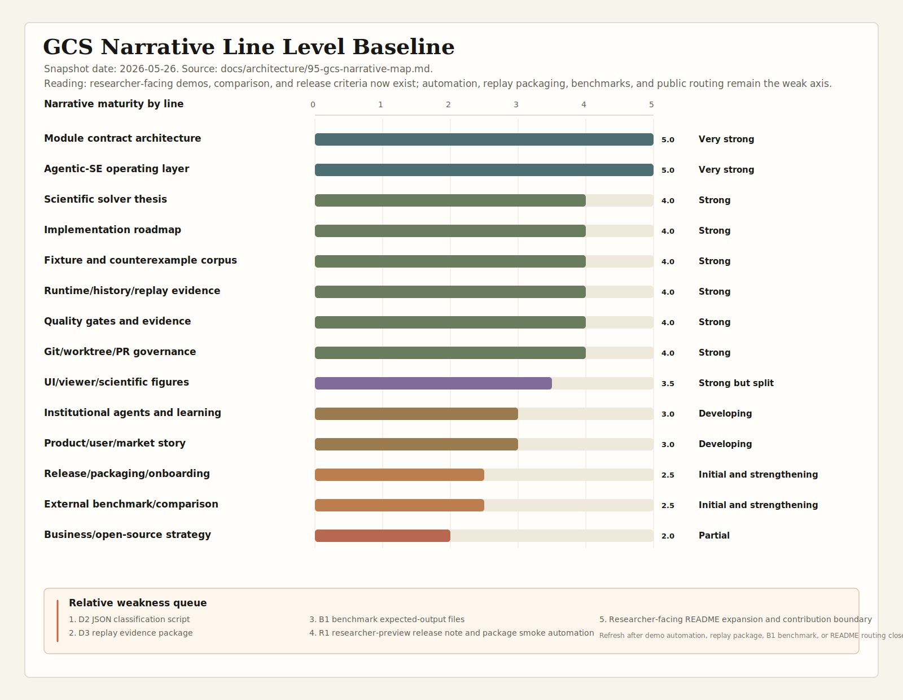

# GCS Narrative Map

Status: active
Date: 2026-05-26

## Purpose

This document compresses the current GCS project story into one durable map.
It records the development level of each narrative line, the next plan for each
line, and the execution rhythm for turning strong internal artifacts into a
legible solver, product, and agentic-organization story.

Background research lives in
`docs/research/20260526/ai-organization-frontier/`. This architecture note is
the active project-facing version.

## One-Sentence Spine

GCS solves geometric constraints by producing evidence-rich local-to-global
reports, and it builds itself through an evidence-rich agentic organization.

Every future narrative, roadmap, and demo should make clear which side it
advances:

- better solver evidence;
- better user-facing workbench;
- better fixture and benchmark corpus;
- better agentic organization;
- better governance, metrics, and learning.

## Current Development Level

Baseline visual:
`docs/architecture/70-visualization/assets/figure95-narrative-line-level-baseline-20260526.svg`.
Baseline brief:
`docs/architecture/70-visualization/narrative-line-level-baseline-20260526.md`.
Trend brief:
`docs/architecture/70-visualization/narrative-line-level-trend-20260526.md`.

| Narrative line | Level | Current state | Main gap | Next move |
| --- | --- | --- | --- | --- |
| Scientific solver thesis | Strong | Local-to-global semantics, reports, diagnostics, and obstruction vocabulary are clear. | The "why users should care" story is less visible than the internal math story. | Attach solver evidence to user-facing demo scenarios. |
| Module contract architecture | Very strong | Target modules, dependency direction, and contract-test posture are explicit. | Prototype names and detailed implementation may still lag target vocabulary. | Keep every new change mapped to target module, report surface, and contract evidence. |
| Implementation roadmap | Strong | Step history and upcoming solver work are recorded in depth. | New readers need a compressed view of roadmap arcs. | Maintain this map as the one-page entry point and keep details in the roadmap. |
| Fixture and counterexample corpus | Strong | Verification, generated, milestone, showcase, and counterexample assets exist. | The corpus is not yet narrated as a maturity ladder. | Define corpus levels and acceptance evidence per level. |
| Runtime/history/replay evidence | Strong | Replay evidence, saved-report workflow, and D3 schema-aware checker are now concrete differentiators. | The checker is not yet wired into an R2 release gate. | Use replay evidence as the trust bridge between solver behavior and agentic governance. |
| Agentic-SE operating layer | Very strong | Task cards, runbooks, archives, quality gates, PR audit, institutional agents, and an operating map exist. | The next risk is process sprawl rather than absence. | Keep `docs/agentic/agentic-organization-operating-map.md` as the compact entry point. |
| Quality gates and evidence | Strong | Local validators, contract tests, tool tests, fixture gates, and quality scripts exist. | Trend visibility is still thin. | Maintain `docs/agentic/metrics-dashboard.md` after non-trivial tasks. |
| UI/viewer/scientific figures | Strong, integration in progress | Viewer, visual QA, figure pipeline, Solver Evidence Workbench direction, and an explicit UI/viewer/figure integration plan exist. | The next proof point must show one evidence chain from report to viewer to figure/demo artifact. | Promote one end-to-end evidence walkthrough using `docs/architecture/97-ui-viewer-figure-integration-plan.md`. |
| Institutional agents and learning | Developing | Standing agents, templates, examples, refusal evals, and a registry scorecard exist. | Seed agents need more examples before promotion. | Use `docs/agentic/institutional-agent-registry-and-scorecard.md` before status changes. |
| Git/worktree/PR governance | Strong | Worktree, branch, PR audit, permissions, threat matrix, repository-audit policies, and exercised governance eval evidence exist. | E-GOV-001 is ready for validator-candidate design, but no validator is implemented yet. | Convert E-GOV-001 into a scoped validator candidate. |
| Product/user/market story | Strong but split | Researcher primary audience, product brief, demo ladder, D1/D2/D3 demos, D5 static workbench package, README route, and contributor boundary exist. | Actual external reviewer feedback and live workbench walkthrough are still missing. | Convert the first researcher review packet into a real review archive. |
| Release/packaging/onboarding | Strong but split | A 20-minute contributor path, release-readiness checklist, R1 researcher-preview note, package smoke automation, and D3 replay checker exist. | Reproducible build transcript and R2 release criteria are not yet consolidated. | Add R2 reproducible build transcript and wire replay checker into the release gate. |
| External benchmark/comparison | Strong but split | External comparison plan, benchmark criteria, feasibility matrix, B1 expected outputs, D2 JSON summary, and B2 candidate review exist. | No executable external baseline run exists yet. | Decide and document the first optional SolveSpace or FreeCAD external adapter. |
| Business/open-source strategy | Developing | Primary audience, README route, contribution boundary, R1 preview route, and first external researcher review packet are documented. | Public distribution and actual external contribution workflow are still researcher-preview only. | Archive the first real external review or contribution. |

## Narrative Map V2: Evidence Routes And Promotion Gates

The v2 map adds two fields to each narrative line:

- evidence artifact: the file, command, or report that proves the line is real;
- promotion gate: the next condition that can justify raising the line's
  maturity level.

| Narrative line | Evidence artifact | Promotion gate |
| --- | --- | --- |
| Scientific solver thesis | CLI report evidence in D1/D2/D3 packages. | Add a B2 microbenchmark that isolates one solver-semantics claim. |
| Module contract architecture | `docs/architecture/30-contracts/` and module design docs. | Keep new implementation changes mapped to target contracts and report surfaces. |
| Implementation roadmap | Step execution reports and this narrative map. | Add a compressed roadmap arc when the next solver milestone closes. |
| Fixture and counterexample corpus | `docs/architecture/96-fixture-corpus-maturity-ladder.md` and B1 expected outputs. | Promote a stable C2 seed toward B2 with expected report fields and migration notes. |
| Runtime/history/replay evidence | `docs/product/demos/d3-replay-evidence/`, replay JSON, and `g1-replay-evidence.check.json`. | Wire the replay checker into R2 release-readiness evidence. |
| Agentic-SE operating layer | Task cards, completed archives, operating map, governance roadmap, and exercised governance evidence note. | Convert only the highest-signal exercised eval into a validator candidate. |
| Quality gates and evidence | Agentic toolkit validators and R1 package smoke. | Add trend history after several non-trivial closures. |
| UI/viewer/scientific figures | Figure 95 baseline/trend, UI architecture docs, and D5 static screenshot package with visual QA. | Build a live workbench walkthrough only when viewer evidence projection is ready. |
| Institutional agents and learning | Institutional-agent registry and scorecard. | Promote only after examples, refusal cases, and eval evidence accumulate. |
| Git/worktree/PR governance | Permission policy, threat matrix, PR audit docs, scoped commits, and `docs/agentic/evals/governance/exercised-evidence-20260526.md`. | Build E-GOV-001 validator candidate with false-positive notes. |
| Product/user/market story | README researcher route, D1/D2/D3 packages, D5 static package, contribution boundary, and review packet. | Capture actual external reviewer feedback and update the review archive. |
| Release/packaging/onboarding | R1 release note, R1 package smoke JSON, and D3 replay checker. | Add reproducible build transcript and R2 criteria. |
| External benchmark/comparison | B1 expected outputs, external comparison plan, feasibility matrix, and B2 candidate review. | Produce the first optional external baseline run or source-level comparison note. |
| Business/open-source strategy | Researcher audience strategy, contribution boundary, and first review packet. | Archive a real researcher review or contribution. |

## Narrative Arcs

### Arc 1: Solver Evidence

Goal: prove that GCS can solve, diagnose, and explain geometric constraint
scenes.

Owns:

- mathematical model;
- target module contracts;
- constraint and incidence semantics;
- diagnostics, rank, residual, conflict, redundancy, and obstruction reports;
- fixture and counterexample corpus.

Near-term plan:

1. Keep Step-level implementation roadmap as the detailed execution source.
2. Define corpus maturity levels.
3. Tie each solver milestone to report evidence and at least one demo scene.

### Arc 2: Evidence Workbench

Goal: let a user inspect geometry, constraints, diagnostics, history, and
solver evidence in one local workbench.

Owns:

- Python viewer;
- viewer bridge;
- visual QA gates;
- scientific figures;
- replay and saved-report projection.

Near-term plan:

1. Treat UI as evidence-first interaction.
2. Bind viewer states and scientific figures to the same source evidence.
3. Make replay evidence visible before adding broader UI surface area.
4. Use screenshots and visual QA as acceptance evidence, not decoration.

### Arc 3: Agentic Organization

Goal: make the repository itself a bounded, evidence-rich human-agent
engineering organization.

Owns:

- task cards;
- worktree and branch governance;
- PR audit;
- quality gates;
- completed-task archive;
- institutional agents;
- evals and experience promotion.

Near-term plan:

1. Use `docs/agentic/agentic-organization-operating-map.md` as the compact
   operating entry point.
2. Maintain `docs/agentic/metrics-dashboard.md`.
3. Continue task-scoped archives for non-trivial work.
4. Promote institutional-agent rules only after scorecard and eval evidence.
5. Convert governance risks into staged evals before adding default gates.

### Arc 4: Product And Adoption

Goal: make the project understandable and useful to an external human.

Owns:

- target user and jobs-to-be-done;
- demo ladder;
- onboarding path;
- release-readiness path;
- external comparison and benchmark positioning.

Near-term plan:

1. Start with `docs/product/gcs-product-user-brief.md`.
2. Convert the strongest internal scenarios into demo workflows.
3. Add a 20-minute new contributor path once demo workflows stabilize.

## Relative Weakness Analysis

The strongest internal narratives remain solver architecture, agentic
operating discipline, quality gates, and fixture evidence. The researcher
audience decision, D1/D2/D3 packages, D3 replay checker, D5 static package,
B1 expected outputs, B2 candidate review, R1 smoke automation, README route,
and contribution boundary move the external legibility line forward. The weak
axis is now the next rung of proof: live workbench evidence, reproducible R2
build transcript, executable external baseline, actual external researcher
feedback, and a first governance validator candidate.

| Relative weak line | Current level | Why it is still weak | Strengthening task already in plan |
| --- | --- | --- | --- |
| Product/user/market story | Strong but split | CLI and evidence-route story is strong; D5 now has viewer and figure evidence, but no actual external reviewer response has landed. | Convert the first external researcher packet into a real review archive. |
| Release/packaging/onboarding | Strong but split | R1 smoke and replay checker exist, but reproducible build transcript and R2 release contract do not. | Add R2 reproducible build transcript and release-gate notes. |
| External benchmark/comparison | Strong but split | Feasibility and B2 candidate review exist, but external executable comparison is not yet run. | Decide the first optional SolveSpace or FreeCAD adapter. |
| Business/open-source strategy | Developing | README route, contribution boundary, and review packet exist, but no external contribution example has landed. | Capture first real researcher review or contribution as archive-backed evidence. |
| Governance eval execution | Developing | Three prompt-level eval seeds now have exercised evidence, but no validator candidate is implemented. | Build E-GOV-001 validator candidate before any default gate. |
| Demo evidence packaging | Strong and active | D0, D1, D2, D3, and D5 packages are present; D5 now ties Figure 72, VE-002 viewer canvas evidence, visual QA, and projection contracts together. | Add a full live D5 workbench walkthrough after structured report projection is ready. |

This means the next plan should not primarily add more internal architecture
language. It should translate the existing architecture into evidence packages
that a new user, reviewer, or future contributor can run, compare, and trust.

## Execution Plan

| Phase | Status | Output | Acceptance |
| --- | --- | --- | --- |
| Phase 0: Narrative map | Complete in this batch | `docs/architecture/95-gcs-narrative-map.md` | A reviewer can see all narrative lines and next moves from one document. |
| Phase 1: Product/user brief | Complete in this batch | `docs/product/gcs-product-user-brief.md` | Target users, workflows, promises, non-goals, and first demos are explicit. |
| Phase 2: Metrics dashboard | Complete in this batch | `docs/agentic/metrics-dashboard.md` | Current baseline and update rules are visible. |
| Phase 3: Corpus and demo ladders | Complete in next-stage batch | `docs/architecture/96-fixture-corpus-maturity-ladder.md` and `docs/product/gcs-demo-ladder.md` | Roadmap becomes user-visible capability growth. |
| Phase 4: Permission threat matrix | Complete in next-stage batch | `docs/agentic/permission-threat-matrix.md` | Governance maps private data, untrusted content, outbound channels, writes, branches, and network actions. |
| Phase 5: Onboarding and release path | Partial in next-stage batch | `docs/product/20-minute-contributor-path.md`; release checklist remains later | A new contributor can build context, run light validators, and understand the thesis. |
| Phase 6: AI organization operating narrative | Complete in this batch | `docs/agentic/agentic-organization-operating-map.md`, `docs/agentic/institutional-agent-registry-and-scorecard.md`, `docs/agentic/governance-eval-roadmap.md`, `docs/product/demos/agentic-task-closure-demo/README.md` | The agentic organization story has operating, role, eval, and demo artifacts. |
| Phase 7: Researcher-facing demos | Complete in researcher-audience batch | `docs/product/demos/d1-cli-smoke/` and `docs/product/demos/d2-diagnostic-classification/` | Researchers can run command-level smoke and diagnostic classification paths. |
| Phase 8: External positioning | Complete as seed | `docs/architecture/97-external-solver-comparison-and-benchmark-plan.md` and `98-benchmark-candidate-selection-criteria.md` | GCS can explain how it differs from academic, open-source, and commercial solver baselines without benchmark overclaiming. |
| Phase 9: Release and researcher distribution strategy | Complete as seed | `docs/product/release-readiness-checklist.md` and `docs/product/researcher-audience-strategy.md` | GCS can explain who should adopt it first, how to try it, and what readiness means. |
| Phase 10: Governance eval seeds | Complete as seed | `docs/agentic/evals/governance/` | The three highest-priority prompt-level governance evals are concrete. |
| Phase 11: Researcher evidence route | Complete in evidence-roadmap batch | D2 JSON classifier, D3 replay package, B1 expected outputs, R1 preview, README route, Narrative Map v2, and Figure 95 refresh | A researcher can move from README to CLI evidence, replay evidence, expected outputs, and release smoke without raw chat context. |
| Phase 12: Third-stage evidence package | Complete in this batch | D3 replay checker, external-baseline feasibility matrix, B2 candidate review, D5 static workbench package, first external review packet, exercised governance evidence, and Figure 95 trend | The prior weak-axis tasks now have concrete artifacts while preserving caveats about live GUI, real external feedback, and external executable benchmarks. |

## Decision Rules

- Architecture truth stays under `docs/architecture/`.
- Operating workflow truth stays under `docs/agentic/`.
- Product and audience truth may live under `docs/product/`.
- Research remains under `docs/research/` until promoted into active project
  docs.
- A narrative line becomes mature only when it has evidence, ownership, an
  update rhythm, and a visible next action.

## Next Task Queue

1. Add an R2 reproducible build transcript and release-gate note.
2. Build an E-GOV-001 validator candidate for scoped staging evidence.
3. Add B2 expected-output files for B2-01 and B2-02.
4. Decide the first optional external adapter path: SolveSpace application or
   FreeCAD Sketcher.
5. Keep the D5 Solver Evidence Workbench package current with Figure 72,
   VE-002 viewer artifacts, visual QA, and projection evidence; add a full live
   walkthrough only after structured report projection is ready.
6. Convert the first external researcher review packet into an actual review
   archive after real feedback arrives.
7. Add a contribution workflow example once the first external review or
   contribution changes the repository.

## Review Triggers

Review this map when:

- a major solver roadmap phase closes;
- a product/demo workflow changes;
- agentic-SE governance adds a new default gate;
- an institutional agent is promoted;
- the project prepares a public-facing release or README expansion.
