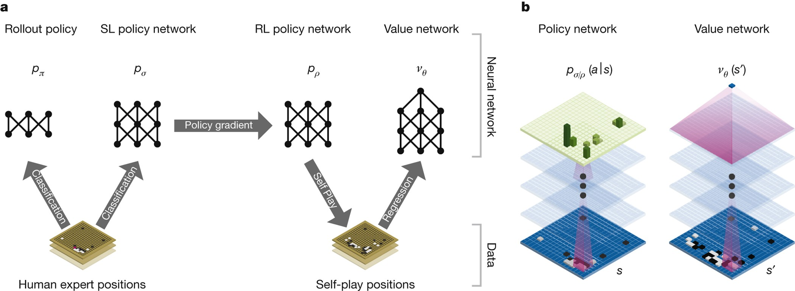
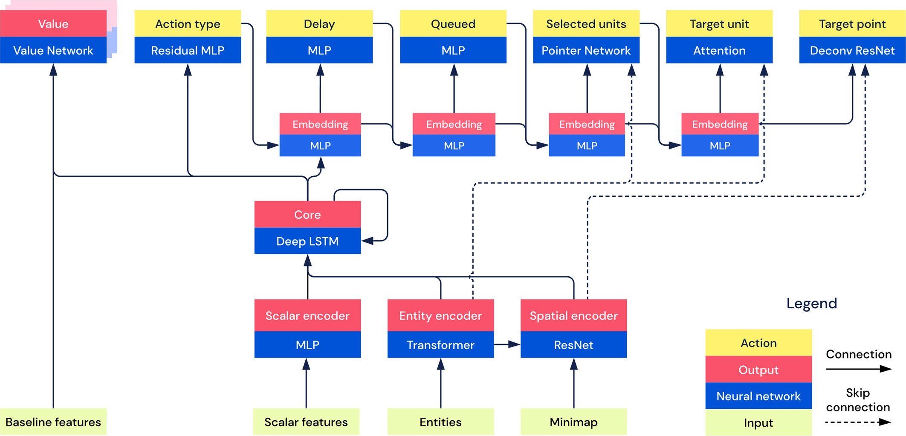
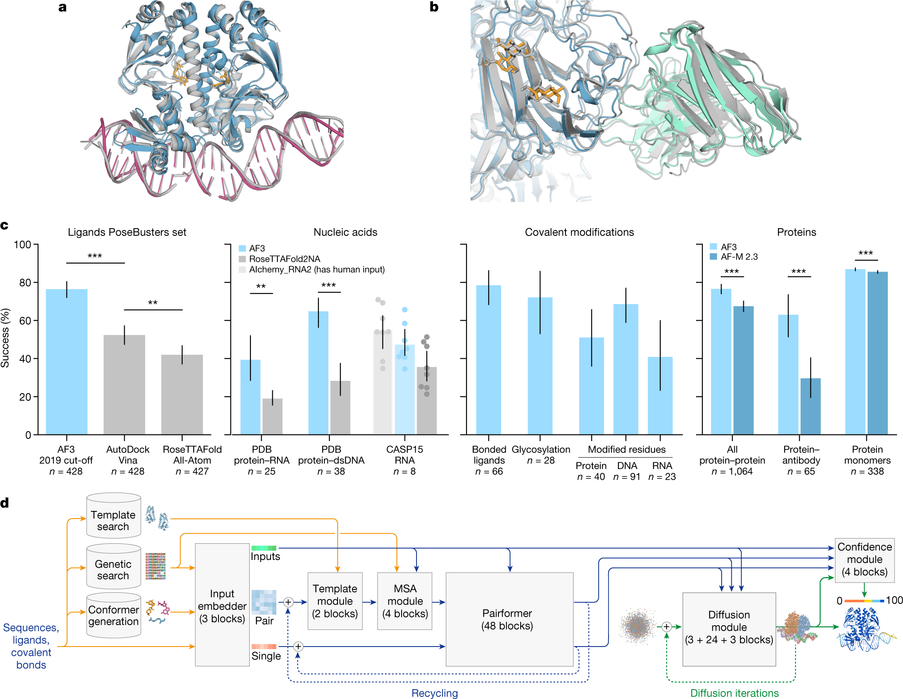
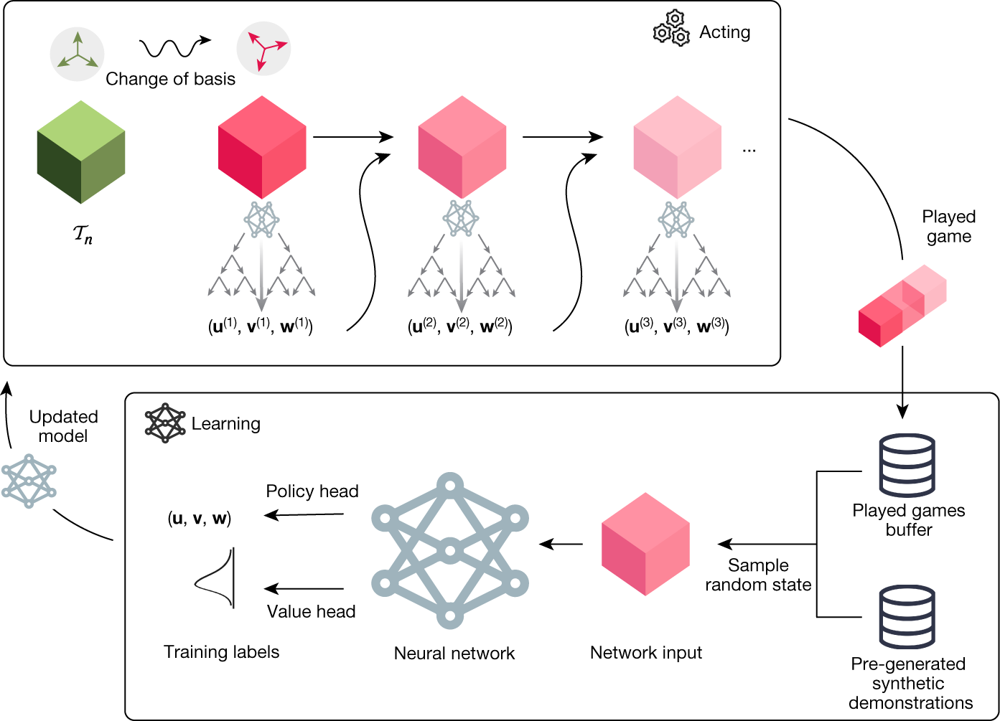
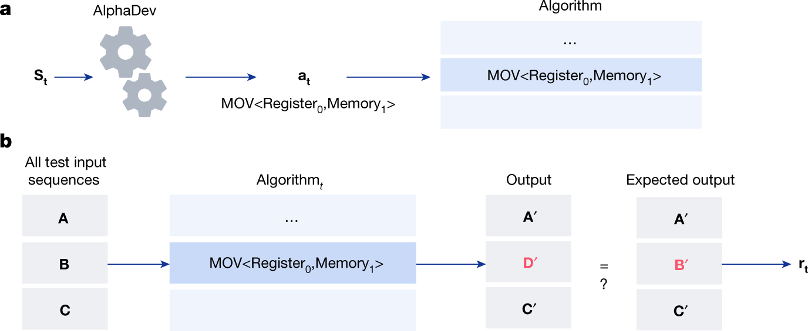
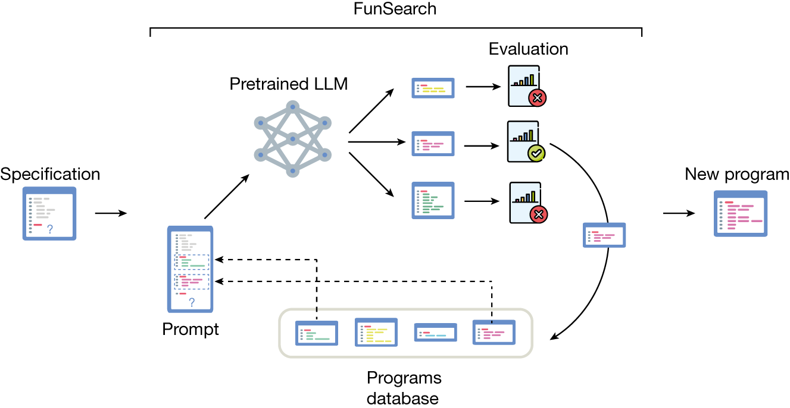
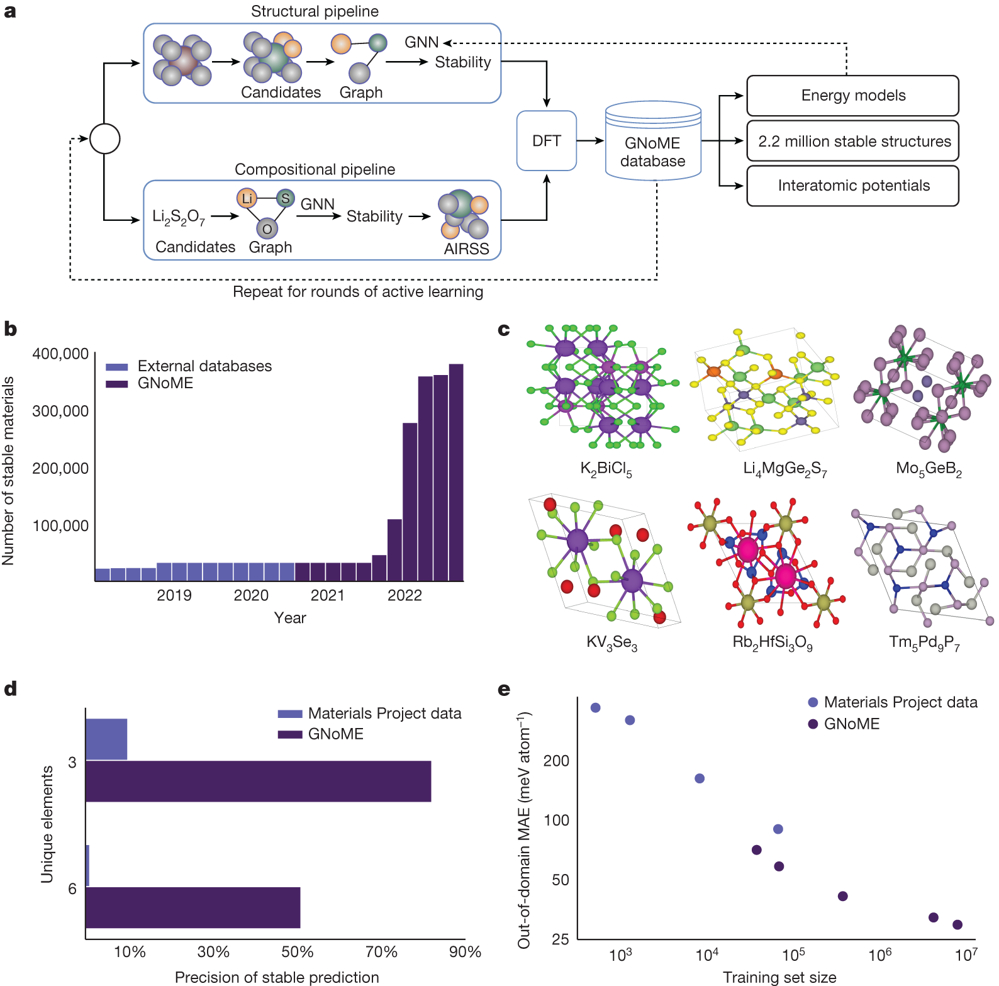
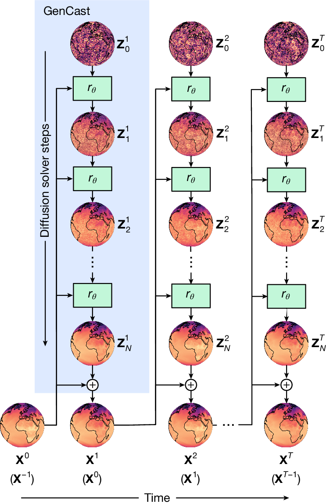
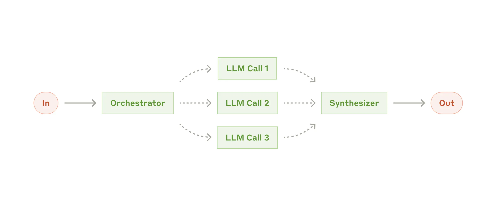

# 顶级 AI 架构图案例研究

Research snapshot: 2026-05-23.

## 说明

本文件收集 10 个顶级 AI 系统架构/流程图案例，重点选择 Nature 论文和顶级 AI 公司官方发布中的精美架构图。图片已按研究用途缓存到 `assets/top-ai-architecture-figures/`；每个案例仍保留官方来源链接，以便核对出处、版权和原始上下文。

选择标准：

- 由顶级 AI 公司或其研究团队发布；
- 图像不是普通流程图，而是面向顶刊/官方发布的高完成度视觉表达；
- 对 GCS 有可迁移价值：复杂系统、局部到全局、验证证据、搜索/求解/反馈闭环、报告化结果。

## 快速结论

这些顶级架构图的共同点不是“更炫”，而是“更有科学图形学纪律”：

- 一张图通常承担一个主论点，并用 a/b/c/d 子图同时呈现机制、证据和样例。
- 节点很少只是方框，常被设计成对象本身：蛋白结构、地球场、代码片段、张量、晶体、棋盘、LLM prompt。
- 颜色承担语义，不承担装饰：输入、隐藏表征、输出、反馈、真实结构、预测结构各有稳定色。
- 箭头不是随意连线，而是表达数据流、时间、反馈、候选生成、评价、筛选或递归。
- 图会显式呈现评估闭环：prediction -> evaluator -> database/report -> next iteration。
- 图内文字短，图外 caption 精准；复杂解释留给 caption，而不是塞满画布。
- 高水平审美是 editorial clarity：白底、细线、局部高饱和、边界留白、可读字体、清晰子图编号。

对 GCS 来说，最值得学习的是：不要只画模块依赖图。应画出一个 Nature 风格的主图，展示“几何约束系统如何从模型、图结构、局部 context cover、数值 local sections、gluing diagnostics 到 verified command result”。

## 10 个案例

### 1. AlphaGo: Neural Network Training Pipeline And Architecture

来源：[Nature: Mastering the game of Go with deep neural networks and tree search](https://www.nature.com/articles/nature16961)

介绍：AlphaGo 图把监督学习、强化学习、自博弈、policy network、value network 和棋盘表示放在同一张图里。它并不追求美术插画，而是用极简神经网络 glyph、棋盘层和数据来源箭头展示“从人类棋谱到自我改进”的系统论点。

特点：

- 抽象层级控制得很好：训练流程和网络结构并置，但不混乱。
- 黑白神经网络 glyph 与彩色棋盘形成注意力层次。
- 通过 `SL policy -> RL policy -> value` 的阶段转换，展示能力形成路径。
- 适合表达“学习过程本身就是架构的一部分”。

GCS 可借鉴：在主图里不要只画 solver 结果，也要画“如何形成可求解问题”：scene/command -> validated model -> incidence graph -> cover plan -> local solve。

### 2. AlphaStar: Overview Of The Architecture

来源：[Nature: Grandmaster level in StarCraft II using multi-agent reinforcement learning](https://www.nature.com/articles/s41586-019-1724-z/figures/7)

介绍：AlphaStar 的扩展数据图强调复杂环境中的结构化输入、多模态编码、memory/core、policy heads 和动作选择。它适合观察“复杂输入空间如何被规整成神经系统”。

特点：

- 高密度但仍分层：units、actions、observations、core、heads 各占固定区域。
- 多输入流通过 pooling/attention 汇合，表达复杂游戏状态的归约。
- 视觉上不是漂亮插画，而是工程级 schema；可信度来自完整性。
- 将“动作语义”显式拆成多个 heads，避免一个黑箱输出。

GCS 可借鉴：约束求解也应把输入语义拆开画：entities、constraints、rigid sets、tolerances、solve intent、reports，不应只画一个 “Solver” 黑箱。

### 3. AlphaFold 2: Model Architecture In A Scientific Performance Figure

来源：[Nature: Highly accurate protein structure prediction with AlphaFold](https://www.nature.com/articles/s41586-021-03819-2/figures/1)

介绍：这张图把 benchmark、真实结构对比、局部化学细节、大蛋白案例和模型架构放在一张 Figure 1 中。真正强的地方是“架构图不是孤立图”，而是和结果证据同画布出现。

特点：

- 下半部分是 architecture，顶端是 evidence；机制和可信度合体。
- Evoformer、structure module、recycling 等模块被画成可读的稳定结构。
- 输入、MSA、templates、pair representation、structure output 颜色明确。
- 结果图让读者马上知道架构为什么重要。

GCS 可借鉴：我们的顶级图也应把 architecture 和 diagnostic evidence 合体：左侧画 pipeline，右侧画 well/under/over/inconsistent 四种报告样例或 residual/rank evidence。

### 4. AlphaFold 3: Architecture With Physical Output Semantics

来源：[Nature: Accurate structure prediction of biomolecular interactions with AlphaFold 3](https://www.nature.com/articles/s41586-024-07487-w/figures/1)

介绍：AF3 的 Figure 1 把结构预测实例、多个任务指标和 inference architecture 放在一起，尤其强调从 sequence/ligand/covalent bonds 到 Pairformer、diffusion module 和 confidence module 的路径。

特点：

- 黄色输入、蓝色抽象网络激活、绿色输出数据，色彩是语义编码。
- 物理 atom coordinates 用球体表现，避免全图变成抽象方框。
- diffusion iterations 用循环箭头表达，而不是用长文字解释。
- benchmark 与 architecture 同画布，强调“结构不是装饰，结构解释性能”。

GCS 可借鉴：GCS 的最终坐标、约束残差和 gluing obstruction 应有物理可视形态，例如点/线/刚体/边界重合误差，而不是只用文本报告。

### 5. AlphaTensor: Overview Of A Search-And-Learn System

来源：[Nature: Discovering faster matrix multiplication algorithms with reinforcement learning](https://www.nature.com/articles/s41586-022-05172-4/figures/2)

介绍：AlphaTensor 图把 actor、MCTS planner、played games、synthetic demonstrations、network training、policy/value 输出整合成闭环。它是强化学习系统架构图的典型范式。

特点：

- 上下分层：上层 actors/search，下层 neural network/training。
- 明确显示两个数据源：previously played games 与 synthetic demonstrations。
- MCTS 与 network 之间的循环是主视觉结构。
- 图中有张量对象，保留问题域的数学物体。

GCS 可借鉴：应把 decomposition planner 与 numeric engine 的关系画成“任务生成 -> local section -> diagnostics evidence -> planner/runtime decision”的闭环，而不是线性流水线。

### 6. AlphaDev: AssemblyGame And Correctness/Latency Evaluation

来源：[Nature: Faster sorting algorithms discovered using deep reinforcement learning](https://www.nature.com/articles/s41586-023-06004-9/figures/2)

介绍：AlphaDev 的关键图把 assembly program generation、correctness test、latency reward 放在同一评价闭环中。它展示的是“发现算法”而非只展示神经网络。

特点：

- 程序本身是图形对象，代码片段进入了架构图。
- correctness 和 latency 是 reward 的两个证据源，评价机制非常显式。
- 错误输出用红叉、正确输出用绿勾，低成本表达状态。
- 游戏化 framing 让复杂算法发现过程变得可讲述。

GCS 可借鉴：约束求解的 reward/evidence 对应 residual、rank、DOF、conditioning、boundary agreement；这些不应藏在日志里，应像 AlphaDev 一样显式画进图中。

### 7. FunSearch: LLM + Evaluator + Program Database Loop

来源：[Nature: Mathematical discoveries from program search with large language models](https://www.nature.com/articles/s41586-023-06924-6/figures/1)

介绍：FunSearch 图是近年最值得学习的 LLM 系统图之一：specification、prompt、pretrained LLM、evaluation、program database、新程序输出，被画成一个简洁闭环。

特点：

- 主循环非常清晰：sample -> prompt -> generate -> evaluate -> store -> resample。
- database 被画成记忆/种群，不只是文件夹。
- 评价失败和成功直接进入图形语义。
- 图的留白和曲线反馈线让读者先看懂闭环，再读细节。

GCS 可借鉴：我们的 agentic overlay 和 contract tools 可借鉴此图：architecture docs + module inventory -> specialist agent -> typed tool -> eval/report store -> accepted task。

### 8. GNoME: Discovery Flywheel + Evidence Dashboard

来源：[Nature: Scaling deep learning for materials discovery](https://www.nature.com/articles/s41586-023-06735-9/figures/1)

介绍：GNoME 图把 discovery pipeline、active learning flywheel、database、bar chart、晶体结构样例和 out-of-domain generalization 组合在一起。它是“系统架构 + 规模证据 + 物理样例”的成熟范式。

特点：

- a 子图是 flywheel，b-e 子图是证据矩阵。
- 图同时服务两类读者：系统工程师看 pipeline，领域科学家看材料结构与指标。
- 反馈虚线明确表示 rounds of active learning。
- 数据库是系统中心，承接模型、DFT、输出资产。

GCS 可借鉴：GCS 的 fixture corpus、golden reports 和 contract tests 应作为数据库/证据中心画出来，显示 architecture 不是静态愿望，而是被场景语料持续校准。

### 9. GenCast: Diffusion-Time Architecture For Weather Forecasting

来源：[Nature: Probabilistic weather forecasting with machine learning](https://www.nature.com/articles/s41586-024-08252-9/figures/1)

介绍：GenCast 图把 diffusion solver steps 与 forecast time steps 正交展示：纵向是 diffusion refinement，横向是 autoregressive time。它用地球场图像替代抽象 tensor，极大增强直觉。

特点：

- 两个时间轴清楚分离：solver iteration 与 forecast time。
- 重复模块只画必要变化，形成节奏感。
- 地球图像让状态变量具象化。
- 蓝色阴影只突出一个 step，帮助读者建立局部模板再推广到全局。

GCS 可借鉴：GCS 也有两个轴：local solve iteration 与 global command pipeline。可以把“一个 subproblem 的 numeric iteration”纵向画，把“多个 context 的 gluing sequence”横向画。

### 10. Anthropic: Orchestrator-Workers Workflow

来源：[Anthropic Engineering: Building effective agents](https://www.anthropic.com/engineering/building-effective-agents)

介绍：Anthropic 的 agent workflow 图比 Nature 图更轻，但非常现代：低饱和绿、灰色虚线、极少节点、强留白。它适合解释软件架构中的 agentic overlay。

特点：

- 几乎没有装饰，但有强烈产品级克制。
- 虚线表达动态委派与回收，实线表达主流输入输出。
- Orchestrator 与 Synthesizer 分工明确，避免把 agent 画成万能黑箱。
- 与文字说明互补，不试图在图内塞满所有情况。

GCS 可借鉴：GCS 的 architecture steward / module agents / tools / evals 适合采用这种轻量风格，作为主 solver 图的上层 overlay，而不是混入数学核心图。

## 深层审美与表达规律

### 1. 科学图不是 icon 堆砌，而是证据结构

Nature 风格的高级感来自“可信的信息结构”。AlphaFold 与 GNoME 把模型结构和结果证据并列；AlphaDev 与 FunSearch 把 evaluator 放进主循环；GenCast 明确区分 diffusion steps 和 forecast time。它们都在回答：系统为什么可靠？

GCS 的图必须回答同样的问题：为什么一个 solve result 可以被接受？答案是 validation、rank/residual evidence、boundary agreement、gluing report、post-solve verification，而不是“因为 Solver 说 solved”。

### 2. 领域对象要进入图中

AlphaFold 有蛋白结构，GNoME 有晶体，GenCast 有地球，AlphaDev 有 assembly code，AlphaGo 有棋盘。顶级图从不只画“模块方框”，它会把领域对象作为视觉主角。

GCS 的领域对象是：

- points、lines、rigid sets、constraints；
- incidence hypergraph；
- context cover；
- boundary overlap；
- local section；
- global proposed state；
- obstruction/conflict/redundancy report。

这些应以小型几何图、hypergraph、局部窗口、边界残差热度条的形式进入主图。

### 3. 复杂系统要用 panel storytelling

一张顶级 Figure 1 往往不是单一流程图，而是 4-6 个 panel：

- a: problem/domain object；
- b: architecture/dataflow；
- c: learning/solving loop；
- d: benchmark/evidence；
- e: representative case；
- f: failure or ablation。

GCS 应采用同样方法，而不是让一张 Mermaid 图承担所有任务。

### 4. 颜色是符号系统

推荐为 GCS 固定一套 Nature-style palette：

| 语义 | 颜色建议 | 用途 |
| --- | --- | --- |
| durable model truth | deep blue | `kernel`, IDs, snapshots |
| structural graph | violet | incidence hypergraph, separators |
| planning/context cover | teal | `CoverPlan`, contexts, boundaries |
| numeric solve | green | residual/Jacobian/local section |
| diagnostics/evidence | amber | reports, rank, DOF |
| obstruction/failure | vermilion | conflicts, inconsistent overlaps |
| boundary/viewer/IO | neutral gray | adapters, CLI, viewer |

不要使用大面积紫蓝渐变或装饰性发光。高级感来自局部高饱和与大量留白。

## GCS 应如何绘制到同等水平

### 推荐主图：Figure 1 - GCS Local-To-Global Constraint Solving

目标：让一个新读者在 60 秒内理解 GCS 的独特架构：它不是一个 least-squares 黑箱，而是一个带证据的局部到全局几何约束求解系统。

建议画成 5 个 panel：

#### Panel a: Domain Object

画一个小型几何场景：3-5 个 rigid sets、点/线/距离/角度约束。旁边同时给出 incidence hypergraph 小图。

视觉重点：

- 几何对象与 graph shadow 并置；
- stable IDs 以小标签呈现；
- same-rigid-set invalid edge 可用淡红虚线表示。

#### Panel b: Contract Pipeline

画从 `Command/Scene` 到 `CommandResult` 的主路径：

`Intake -> Normalize -> Validate -> Index -> Decompose -> Diagnose -> Plan -> Solve -> Assemble -> Verify -> Commit/Reject`

视觉重点：

- 每个阶段只显示 1 个核心 contract；
- 每段箭头上标出 report evidence；
- commit 前有明显 transaction gate。

#### Panel c: Local-To-Global Cover

画全局模型被覆盖成三个 `ContextSnapshot`，上下文之间有 overlap/boundary；每个 context 产生 `LocalSection`，然后进入 `GluingReport`。

视觉重点：

- 用透明色块覆盖几何图，而不是另起纯方框；
- overlap 区域用更深色或条纹；
- boundary residual 用小热度条表示。

#### Panel d: Numeric Evidence

画 `NumericTask` 内部：active variables、active equations、residual vector、Jacobian/rank estimate、iteration trace。

视觉重点：

- residual/Jacobian 可简化成矩阵小块；
- rank/condition 作为仪表或紧凑表格；
- local section 是 proposal，不直接连到 committed state。

#### Panel e: Diagnostics And Outcomes

画 4 个小卡片式状态：well constrained、under constrained、redundant/over constrained、inconsistent obstruction。

视觉重点：

- 每个状态都要有几何小图 + report code + involved IDs；
- inconsistent 用 failed boundary gluing 表达；
- accepted path 与 rejected path 并列，不只展示 happy path。

### 推荐第二张图：Figure 2 - Module Ownership And Dependency Direction

这张图用于工程团队，而不是论文首页。它应比 Figure 1 更克制：

- 下层 `kernel` 在底部作为 durable truth；
- `constraint_catalog`、`incidence_graph`、`numeric_engine`、`diagnostics` 作为中层数学服务；
- `session_runtime` 是事务门；
- `io_adapters`、`viewer_bridge`、CLI、Python GUI 在边界；
- agentic overlay 以淡灰虚线悬浮在上方。

关键是展示禁止依赖：lower solver modules must not import UI/IO/viewer/app lifecycle。

### 推荐第三张图：Figure 3 - Diagnostic Certificate

这张图把 GCS 与普通 CAD solver 区分开：

- 输入：几何场景；
- 左支：structural DOF / incidence evidence；
- 中支：numeric residual / rank evidence；
- 右支：boundary gluing / obstruction evidence；
- 输出：`CommandResult` with stage reports。

这个图应像 GNoME 那样，把 pipeline 和证据面板放一起。

## 可执行制图规范

为了达到 Nature/DeepMind 水平，建议不要直接从 Mermaid 导出最终 Figure。Mermaid 适合 architecture-as-code 和审查，但最终顶级图应采用以下生产流：

1. Mermaid / D2：维护结构真相和节点 ID。
2. Figma / Illustrator / SVG：进行最终版面、字体、色彩和 panel composition。
3. Python/Matplotlib 或自定义 SVG：生成 residual、Jacobian、hypergraph、DOF chart 等数据化子图。
4. 统一导出 SVG + PNG：SVG 用于文档，PNG 用于报告或 README。
5. 将 Figure 源文件和导出图一起放入 `docs/architecture/70-visualization/assets/`，并保留生成脚本。

图像规格：

- 画布：16:9 或 Nature-like 180 mm 宽横图；
- 背景：白色；
- 字体：Inter / Helvetica / Arial，正文 8-10 pt，标题 11-13 pt；
- 线宽：1.25-1.75 px；
- 圆角：4-6 px，不用大圆角卡片；
- 箭头：尽量水平/垂直，少交叉；
- 子图编号：a、b、c、d、e，左上角粗体；
- caption：每个 panel 1 句，正文解释留到图下。

## 与现有 GCS 图册的关系

现有 `docs/architecture/70-visualization/gcs-architecture-atlas.md` 是架构真相图册，适合维护和审查。下一步的顶级图片应从 atlas 中抽取 1-2 个核心图，升级为 Nature-style figure：

- 从 “Local-To-Global Semantic Map” 提炼 Figure 1 的 panel c；
- 从 “Runtime Contract Pipeline” 提炼 Figure 1 的 panel b；
- 从 “Module Dependency Topology” 提炼 Figure 2；
- 从 “Agentic Design Overlay” 提炼 Anthropic-style overlay；
- 新增 geometry/rendered diagnostic panels，补上目前 atlas 缺少的领域对象与证据视觉。

最高优先级不是再加更多图，而是把“GCS 为什么可信”画出来：typed contracts、stable IDs、context cover、local sections、gluing report、obstruction report、verified transaction。

## 下一步建议

1. 为 GCS 制作一张 `Figure 1 - GCS Local-To-Global Constraint Solving` 的 SVG 视觉稿。
2. 建立 `docs/architecture/70-visualization/assets/`，存放原创 GCS 图，不存放第三方案例图。
3. 写一个小脚本从 fixture 生成 geometry panel、incidence graph panel 和 residual/rank mini chart。
4. 把当前 Mermaid atlas 作为 structural source，最终 SVG 作为 editorial artifact。
