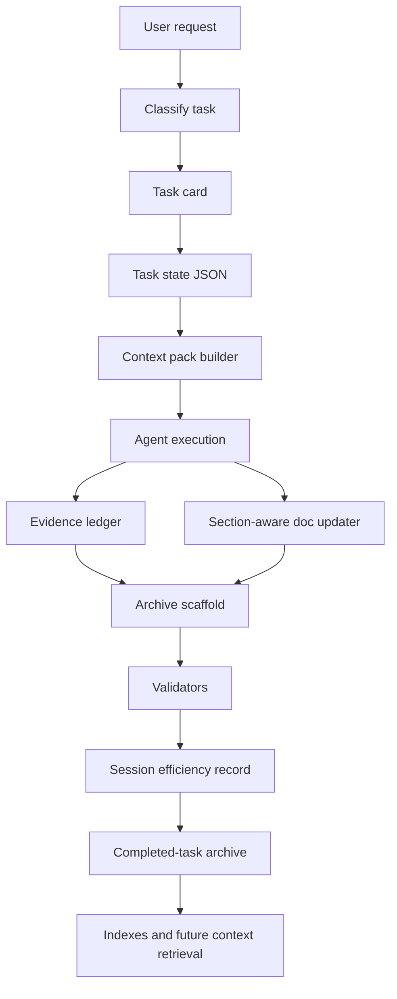

# Repeated Document Operations And Token Cost: Diagnosis And Operating Design

Date: 2026-05-26

Status: design judgment and implementation-ready proposal.

Scope: this note narrows the earlier research bundle to the concrete GCS
failure mode: institutional/process AI tasks repeatedly read, rewrite, and
synchronize Markdown artifacts, consuming large token budgets. It gives an
engineering judgment, a target architecture, data contracts, workflow design,
tooling plan, metrics, risks, and an implementation sequence.

Language note: this report is written in Chinese because it is a direct answer
to the user's current design request. Source paths and command names remain in
English to match the repository.

## Executive Judgment

我的判断是：这个问题的本质不是「模型上下文不够长」或「token 太贵」，
而是 GCS 现在把一部分本应属于流程运行时、状态数据库、证据系统和文档编译器的工作，
交给了 LLM 的临时上下文来承担。

换句话说，当前的浪费来自一种结构性错位：

- 人类想要的是可审计、可恢复、可复用的制度化流程。
- 现有流程已经形成了任务卡、研究报告、证据、归档、索引、治理说明。
- 但这些流程对象大多仍是 prose-first Markdown。
- 每次 agent 执行任务时，都需要重新读大量文档、重新推断哪些段落相关、重新拼接证据、
  重新更新表格和归档。
- 于是 token 被用来做「流程状态恢复」和「机械文档操作」，而不是用来做判断、设计和验证。

因此，正确方向不是删掉制度性文档。GCS 的制度性文档是资产，删除它会让后续任务失去
边界、证据和记忆。正确方向是把制度性文档「编译」成更便宜的运行时对象：

- 小而稳定的 always-on instructions；
- task-specific context pack；
- 机器可读的 task state；
- append-only evidence ledger；
- 可复用 source register；
- section-aware Markdown updater；
- archive scaffold generator；
- session-efficiency telemetry；
- governance evals。

最终目标不是「少写文档」，而是「让文档变成 agent 能低成本操作的控制平面」。

## Source Register

| Source | Used for | Confidence |
| --- | --- | --- |
| `docs/research/20260526/institutional-process-ai-token-economics/01-research-report.md` | External best-practice synthesis and source register | High |
| `docs/research/20260526/institutional-process-ai-token-economics/02-gcs-solution-design.md` | Initial GCS process-AI token economy design | High |
| `docs/architecture/95-agentic-session-efficiency-governance.md` | Outcome/token metrics, task classes, anti-metrics | High |
| `docs/agentic/agentic-organization-operating-map.md` | GCS operating layers and evidence contract | High |
| `docs/agentic/lifecycle-runbook.md` | Task lifecycle, task card, validation, closure workflow | High |
| `docs/agentic/task-to-archive-checklist.md` | Closure checklist and failure signals | High |
| `docs/reports/session-efficiency/2026-05-26/README.md` | Current session-efficiency reporting state | High |

## Problem Model

### 1. 当前 token 花在哪里

制度性任务的 token 消耗通常来自八类循环：

| Loop | Symptom | Token waste mechanism | Better owner |
| --- | --- | --- | --- |
| Policy replay | 每次都读 runbook、checklist、skills | 重复加载不变规则 | Stable instruction plus sliced context pack |
| State reconstruction | 从聊天和多个 Markdown 推断当前任务状态 | LLM 充当状态数据库 | Task state JSON |
| Source rebuild | 每份报告重复整理相同外部来源 | LLM 反复压缩同一来源 | Source register store |
| Markdown surgery | 手工改索引、表格、证据段 | LLM 做机械编辑 | Section-aware updater |
| Closure narration | 从记忆写 completed-task archive | LLM 回忆操作历史 | Evidence ledger plus archive scaffold |
| Validation interpretation | 重复解释 validator 输出 | 每次重新总结命令结果 | Structured evidence records |
| Resume/compaction recovery | 上下文压缩后重新读大量文档 | 任务 hot state 缺失 | Hot summary and task-state handoff |
| Permission ambiguity | agent 反复解释/询问能否操作 | 边界不清导致分析空转 | Permission profile by task class |

这些循环里，只有一部分值得由 LLM 处理。LLM 应该负责判断、综合、设计、风险识别和
例外处理；不应该反复承担表格定位、证据拷贝、索引更新、模板重建和状态恢复。

### 2. 不应该优化掉的 token

有些 token 是必要成本，不能简单削减：

- 首次理解高风险需求；
- 读取直接相关架构边界；
- 对来源可信度做判断；
- 对测试失败和 skipped checks 做解释；
- 对设计 tradeoff 做推理；
- 对残余风险、后续任务、推广条件做判断。

如果为了省 token 而跳过这些环节，短期看起来更便宜，长期会用返工、错误归档、错误角色推广、
错误 source claim 和错误权限边界偿还成本。GCS 的目标应当是减少 clerical/context-recovery
tokens，而不是减少 judgment/evidence tokens。

### 3. 关键诊断

我的结论可以压缩成一句话：

> GCS 的 agentic-SE 流程已经从「缺少治理」进入「治理需要运行时化」阶段。

这是一种好问题。它说明项目已经积累了足够多的规则、证据和制度对象，下一步瓶颈从
「有没有流程」变成「流程是否可由 agent 低成本、低歧义、可验证地操作」。

## Target Architecture

目标架构是一个轻量的 Process AI Operating Layer，放在现有 `docs/agentic` 和
`tools/agentic_design` 之间。



Design principle:

- Markdown remains the human-readable durable surface.
- JSON/JSONL becomes the machine-readable process state.
- Tools perform deterministic document operations.
- LLM performs synthesis, judgment, risk analysis, and exception handling.
- Validators check consistency among Markdown, structured state, and evidence.

## Context Architecture

### Hot / Warm / Cold

把上下文分成三层：

| Tier | Content | Load rule | Desired size |
| --- | --- | --- | --- |
| Hot | 当前任务目标、风险、affected paths、最新决策、待验证事项 | 每次恢复都加载 | Hundreds of lines at most |
| Warm | 相关 runbook 切片、相邻归档、source 摘要、设计约束 | 由任务类别选择 | Bounded context pack |
| Cold | 完整报告、旧归档、宽泛文档、raw logs | 仅按需打开 | Not loaded by default |

当前浪费主要来自把 warm/cold 当成 hot 来用。Context pack 的价值在于把 warm context
按任务编译出来，并明确列出 omitted sources，避免 agent 假装依赖没有读过的材料。

### Stable Prefix And Variable Tail

Agent 会受益于稳定前缀：

- 仓库级规则要短、稳定、少变化；
- 任务变量放在 context pack 后段；
- 高频工具说明固定；
- 低频领域材料按需检索。

这不仅减少模型注意力浪费，也更适合 prompt caching 类机制。即使本地运行时暂时无法精确
计量缓存命中，结构上也应当朝这个方向设计。

## Data Contracts

### 1. TaskState

Path:

```text
docs/agentic/tasks/state/<task-id>.task-state.json
```

Purpose:

- 保存当前任务的机器可读状态；
- 给 compaction/resume 一个小入口；
- 连接 task card、context pack、evidence ledger、archive 和 telemetry。

Schema draft:

```json
{
  "schema_version": "gcs-task-state-0.1",
  "task_id": "2026-05-26-example",
  "status": "in_progress",
  "task_class": "research_design",
  "scope": "docs",
  "risk": "medium",
  "owner": "task-scoped-session-closer",
  "human_gate_required": false,
  "hot_summary": "One paragraph current-state handoff.",
  "affected_paths": [
    "docs/research/20260526/example/"
  ],
  "required_sources": [
    {
      "path": "docs/agentic/lifecycle-runbook.md",
      "reason": "task lifecycle rules",
      "tier": "warm"
    }
  ],
  "artifacts": {
    "task_card": "docs/agentic/tasks/2026-05-26-example.md",
    "context_pack": "docs/agentic/tasks/state/2026-05-26-example.context-pack.md",
    "evidence_ledger": "docs/agentic/tasks/state/2026-05-26-example.evidence.jsonl",
    "archive": "docs/completed-tasks/2026-05-26-example/README.md"
  },
  "acceptance": [
    "validate-task-card",
    "validate-completed-task-report",
    "validate-docs"
  ],
  "open_risks": []
}
```

### 2. ContextPack

Path:

```text
docs/agentic/tasks/state/<task-id>.context-pack.md
```

Purpose:

- 当前任务的最小可用上下文；
- 明确哪些来源被纳入、哪些被省略；
- 为后续 agent 提供可读的恢复入口。

Required sections:

```markdown
# Context Pack: <task-id>

## Objective
## Hot State
## Scope And Non-Goals
## Affected Paths
## Required Local Sources
## Required External Sources
## Source Snippets
## Acceptance Gates
## Omitted Sources
## Open Questions
## Estimated Size
```

Selection rules:

- Always include task objective, non-goals, affected paths, required evidence.
- Include runbook slices by task class, not full runbook.
- Include only local source snippets that support a decision in this task.
- Include previous archive summaries only when they directly affect the task.
- List omitted broad docs with reason.

### 3. EvidenceLedger

Path:

```text
docs/agentic/tasks/state/<task-id>.evidence.jsonl
```

Purpose:

- append-only trace of commands, files, decisions, skipped checks, failures;
- archive generator reads this first;
- final report no longer depends on chat memory.

Record examples:

```json
{
  "timestamp": "2026-05-26T20:30:00+08:00",
  "kind": "command",
  "command": "python tools\\agentic_design\\agentic_toolkit.py validate-docs",
  "result": "pass",
  "summary": "[OK] docs: module design coverage passed",
  "paths": ["docs/research/20260526/example/"]
}
```

```json
{
  "timestamp": "2026-05-26T20:35:00+08:00",
  "kind": "decision",
  "summary": "Kept token metrics non-blocking until enough calibrated records exist.",
  "supports": ["docs/architecture/95-agentic-session-efficiency-governance.md"]
}
```

### 4. SourceRegister

Paths:

```text
docs/agentic/source-register/sources.jsonl
docs/agentic/source-register/claims.jsonl
```

Purpose:

- recurring sources are recorded once;
- reports import sources by ID/topic;
- claims point to source IDs and consuming reports.

This prevents every research task from rebuilding the same source table for OpenAI,
Anthropic, GitHub, Google, McKinsey, BCG, Bain, Deloitte, SWE-bench, SWE-agent,
and local GCS governance docs.

### 5. DocumentPatchPlan

Path:

```text
var/agentic-doc-patches/<task-id>/*.doc-patch.json
```

Purpose:

- make mechanical Markdown edits diff-reviewable before write;
- avoid asking the LLM to rewrite whole files;
- enable small deterministic operations.

Schema draft:

```json
{
  "schema_version": "gcs-doc-patch-0.1",
  "target": "docs/completed-tasks/README.md",
  "operation": "insert_table_row",
  "anchor": "completed-tasks-index",
  "match": {
    "heading": "# Completed Tasks",
    "table_columns": ["Date", "Task", "Status"]
  },
  "row": ["2026-05-26", "[Example](2026-05-26-example/README.md)", "done"],
  "idempotency_key": "completed-task:2026-05-26-example"
}
```

`var/` can remain scratch; the committed artifact is the resulting Markdown diff.

### 6. SessionCostRecord

Extend the current session-efficiency idea with process-specific fields:

```json
{
  "task_id": "2026-05-26-example",
  "task_class": "research_design",
  "process_cost": {
    "context_pack_lines": 180,
    "hot_state_lines": 30,
    "local_sources_loaded": 7,
    "cold_sources_opened": 2,
    "deterministic_doc_updates": 4,
    "manual_doc_updates": 2,
    "archive_scaffold_coverage": 0.7,
    "source_reuse_count": 12
  },
  "token_telemetry": {
    "total_tokens": 0,
    "confidence": "unknown"
  }
}
```

Even when exact token counts are unavailable, process-cost proxy metrics can reveal whether the system is moving in the right direction.

## Tooling Design

All commands should initially extend `tools/agentic_design/agentic_toolkit.py`,
because that file already owns task cards, completed-task validators, closure scoring,
PR audit helpers, and lifecycle support.

### 1. `build-context-pack`

Command:

```bat
python tools\agentic_design\agentic_toolkit.py build-context-pack --task docs\agentic\tasks\<task>.md --write
```

Inputs:

- task card;
- optional task-state JSON;
- task class;
- affected paths;
- local source policies;
- optional source register.

Outputs:

- context pack Markdown;
- optional task-state JSON update;
- estimated line/token size;
- omitted-source list.

Algorithm:

1. Parse task card frontmatter and body.
2. Infer task class and source profile.
3. Select required local docs by profile.
4. Extract bounded snippets around headings that match source profile.
5. Add affected paths and direct artifacts.
6. Add previous related archive summaries by slug/topic if configured.
7. Emit omitted broad sources.
8. Fail or warn if pack exceeds configured size.

Default source profiles:

| Task class | Required warm sources |
| --- | --- |
| `research_design` | source-aware research skill, local prior reports, session-efficiency governance |
| `governance_closure` | lifecycle runbook, task-to-archive checklist, completed-task validator expectations |
| `implementation` | owning module skill, local architecture contract, focused tests |
| `debug_repair` | failing evidence, affected module docs, regression conventions |
| `exploration` | stopping condition, prior related research, explicit non-goals |

### 2. `evidence append`

Command:

```bat
python tools\agentic_design\agentic_toolkit.py evidence append --task docs\agentic\tasks\<task>.md --kind command --result pass --summary "<summary>" --command "<command>"
```

Purpose:

- avoid reconstructing command history at closeout;
- support archive scaffolding;
- provide structured evidence for session-efficiency reports.

The command should also support `kind=decision`, `kind=file`, `kind=risk`, and
`kind=skipped_check`.

### 3. `scaffold-completed-task`

Command:

```bat
python tools\agentic_design\agentic_toolkit.py scaffold-completed-task --task docs\agentic\tasks\<task>.md --write
```

Inputs:

- task card;
- evidence ledger;
- changed files from git status;
- optional session cost record.

Outputs:

- completed-task archive draft;
- index patch suggestion;
- missing-evidence warnings.

Generated sections:

- Task Objective
- Scope And Non-Goals
- Interaction Summary
- Work Completed
- Files And Artifacts
- Evidence
- Decisions
- Skipped Checks And Risks
- Learning And Promotion Decision
- Follow-Up
- Archive Handoff
- Final Validation

The LLM should then edit the generated report for judgment, clarity, and risk wording.

### 4. `doc-update`

Command family:

```bat
python tools\agentic_design\agentic_toolkit.py doc-update completed-task-index --archive docs\completed-tasks\<task>\README.md --write
python tools\agentic_design\agentic_toolkit.py doc-update reading-order --index <README.md> --entry <path> --title "<title>" --write
python tools\agentic_design\agentic_toolkit.py doc-update task-evidence --task <task.md> --from-ledger --write
```

Design constraints:

- idempotent by key;
- fails when table shape is unexpected;
- prints a compact diff summary;
- never rewrites unrelated sections;
- no semantic judgment hidden inside the tool.

### 5. `context-pack lint`

Command:

```bat
python tools\agentic_design\agentic_toolkit.py lint-context-pack docs\agentic\tasks\state\<task>.context-pack.md
```

Checks:

- pack has objective, sources, acceptance gates, omitted sources;
- pack does not include full broad docs unless explicitly allowed;
- cited sources exist;
- affected paths are inside task scope;
- estimated size below task-class threshold or warning recorded.

### 6. `process-cost report`

Command:

```bat
python tools\agentic_design\agentic_toolkit.py process-cost report --task docs\agentic\tasks\<task>.md --output docs\reports\session-efficiency\<date>\<task>.process-cost.md
```

Metrics:

- context pack lines;
- hot state lines;
- local source count;
- cold source opens;
- deterministic vs manual doc updates;
- archive scaffold coverage;
- source reuse count;
- skipped checks;
- closure score.

This complements `tools/session_efficiency/` instead of replacing it.

## Workflow Design

### Intake

1. Classify scope, risk, task class, owner.
2. Create task card.
3. Create task-state JSON.
4. Build context pack.
5. If context pack is bloated, trim before deep work starts.

Exit condition:

- The agent can state the task, non-goals, sources, affected paths, and evidence gates from a small pack.

### Execution

1. Use LLM for synthesis/design/implementation.
2. Use deterministic tools for index/table/archive mechanics.
3. Append evidence after each meaningful command or decision.
4. Update `hot_summary` when the task changes phase.
5. If a source not in the pack becomes necessary, add it to the pack or record why it was opened directly.

Exit condition:

- Changed artifacts are within scope.
- Evidence ledger can explain what happened without chat logs.

### Verification

1. Run focused validators/tests.
2. Append results to evidence ledger.
3. If a check is skipped, add `kind=skipped_check` with rationale.
4. Run archive/context validators when applicable.

Exit condition:

- Validation outcome is explicit and reproducible.

### Closure

1. Generate archive scaffold from task card plus evidence ledger.
2. Let LLM edit decisions, risks, learning/promotion section.
3. Use section-aware tool to update indexes.
4. Generate process-cost report when useful.
5. Run validators and closure score.

Exit condition:

- Future agent can resume from task card, context pack, evidence ledger, and archive, without raw chat.

## Permission Model

| Action | Default | Reason |
| --- | --- | --- |
| Read local docs | Allowed | Needed for context pack and validation |
| Write task-state/context-pack/evidence under scoped task | Allowed | Process-local artifacts |
| Update report README reading order | Allowed within report bundle | Mechanical index update |
| Update completed-task index | Allowed after archive exists | Existing lifecycle pattern |
| Browse web | Only for freshness/source tasks | Avoid unnecessary source drift and token cost |
| Modify solver/runtime/IO/viewer | Not part of this layer | Requires module steward and tests |
| Delete files/reset branches/force push | Human approval | Destructive or irreversible |
| Promote an institutional agent | Human/review gate | Requires repeated evidence or severe near miss |

This permission model is also a token-saving mechanism. Ambiguous permissions cause long analysis loops, repeated caveats, and late discovery that an action is not allowed.

## Metrics And Evaluation

### Primary metrics

| Metric | Definition | Desired movement |
| --- | --- | --- |
| `HotStateSize` | Lines/tokens needed to resume current task | Down |
| `ContextPackSize` | Lines/tokens in task-specific pack | Bounded, not always down |
| `ColdOpenCount` | Full old reports/docs opened during task | Down for repeated task classes |
| `SourceReuseRate` | Reused source claims / total source claims | Up |
| `DocAutomationRatio` | Deterministic doc updates / all doc updates | Up |
| `ArchiveScaffoldCoverage` | Archive sections derived from evidence ledger | Up |
| `EvidenceCompleteness` | Required evidence present and validated | Up |
| `ReworkPenalty` | Failed/unresolved process issues | Down |
| `ValuePer1KTokens` | Outcome score per known token cost | Up when telemetry exists |

### Evaluation cases

Add governance evals that catch process-agent failure modes:

| Eval | Failure mode |
| --- | --- |
| Refuse unsupported source claim | Report cites a source without support |
| Refuse full-runbook dump | Context pack includes whole broad docs unnecessarily |
| Refuse archive without evidence | Completed-task archive claims completion without validator output |
| Refuse invented timeline causality | Archive explains why something happened without evidence |
| Refuse role promotion from one example | New institutional agent promoted too early |
| Refuse token-only optimization | Recommendation skips evidence only to save tokens |
| Preserve omitted-source disclosure | Context pack hides what it did not load |

These evals should begin as Markdown test cases under `docs/agentic/evals/governance/`.
Only after examples stabilize should they become executable checks.

## Implementation Roadmap

### Phase A: Minimal State And Context Pack

Deliverables:

- `docs/agentic/tasks/state/` convention;
- task-state JSON schema;
- `build-context-pack` command;
- `lint-context-pack` command;
- one example pack from a real docs task.

Acceptance:

- pack contains objective, sources, snippets, gates, omitted sources;
- pack is smaller than manually reopening all runbook/research docs;
- task card validation still passes;
- broad docs are not copied in full.

### Phase B: Evidence Ledger And Archive Scaffold

Deliverables:

- evidence JSONL schema;
- `evidence append` command;
- `scaffold-completed-task` command;
- archive scaffold generated from one real task.

Acceptance:

- archive can be produced mainly from task card plus evidence ledger;
- manual LLM writing is focused on decisions and risks;
- completed-task validator and closure score pass;
- skipped checks are represented as risk, not hidden.

### Phase C: Section-Aware Document Updates

Deliverables:

- completed-task index updater;
- report README reading-order updater;
- task-card evidence updater from ledger;
- idempotency tests.

Acceptance:

- updater fails safely on unexpected table shape;
- repeated run does not duplicate rows;
- generated diffs stay scoped.

### Phase D: Source Register Reuse

Deliverables:

- `sources.jsonl` and `claims.jsonl`;
- import helper for report source rows;
- duplicate URL/path detector;
- topic lookup.

Acceptance:

- repeated external sources do not require full re-summarization;
- reports remain readable without querying the JSONL directly;
- temporal sources record access date and refresh need.

### Phase E: Process Cost Reporting

Deliverables:

- process-cost record;
- Markdown projection;
- join with existing session-efficiency record when available.

Acceptance:

- unknown token counts remain allowed;
- proxy metrics show whether process overhead is shrinking;
- no blocking policy until at least 10 to 20 comparable sessions exist.

## MVP Recommendation

先做 Phase A + Phase B，不要先做全局 source register。

原因：

- 最大浪费在任务开始和任务结束：开始时重读上下文，结束时重建证据和归档。
- Context pack 解决启动成本。
- Evidence ledger + archive scaffold 解决收尾成本。
- 两者合起来能形成闭环，可以用一个真实任务验证节省，而不是停留在理论。

Suggested first implementation task:

```text
Task: context-pack and evidence-ledger MVP
Scope: tools/agentic_design plus docs/agentic/tasks/state examples
Risk: medium
Owner: task-scoped-session-closer with gcs-contract-tools-steward review
Evidence:
  - unit tests for context selection
  - unit tests for evidence ledger parsing
  - completed archive scaffold smoke
  - validate-task-card
  - validate-completed-task-report
  - validate-docs
```

## Expected Savings

不要一开始承诺百分比。当前本地运行时没有稳定的 exact token telemetry，因此应该先测 proxy。

但从机制上，预期节省来自：

1. 避免每次完整读取 runbook/checklist/旧报告；
2. 避免 compaction/resume 后从聊天恢复状态；
3. 避免 closeout 时凭记忆重写证据；
4. 避免重复整理相同 source register；
5. 避免手工做表格/索引/reading-order 更新；
6. 避免权限不清导致的长分析和回退。

最合理的首批衡量目标：

- context pack 行数低于人工读取源材料总行数的 30% 到 50%；
- completed-task archive 至少 60% 的事实段落可由 evidence ledger 生成；
- repeated source reads 在同类研究任务中下降；
- manual doc updates 在 closeout 阶段下降；
- closure score 不下降。

如果 closure score 或 evidence completeness 下降，就说明 token savings 是伪优化，应回滚策略。

## Risks

| Risk | Why it matters | Mitigation |
| --- | --- | --- |
| 过度压缩上下文 | 重要约束被省略，agent 做错判断 | Context pack 必须列 omitted sources 和 open questions |
| Structured state 与 Markdown 漂移 | 两套事实源冲突 | Validators compare task card, state, ledger, archive |
| 工具错误修改 Markdown | 机械工具把索引/表格改坏 | 小命令、idempotency key、diff-review、fail-closed |
| token 指标诱导跳过证据 | 表面省钱，实际增加返工 | Token metrics non-blocking; pair with closure/rework score |
| source register 过期 | AI 产品/论文/价格变化快 | accessed date, confidence, refresh flag |
| 新流程增加更多文档负担 | 为省 token 又制造新 token 税 | 先生成，后人工判断；用 proxy metric 证明减少 |
| 角色膨胀 | 新问题诱导创建新 institutional agent | 先做工具和 eval，重复证据后再考虑角色 |

## Design Decisions

1. 不删除现有 lifecycle，而是把 lifecycle 编译成运行时对象。
2. 不把 token minimization 做成 blocking gate，至少在校准前不做。
3. 不先推广新 institutional agent，因为当前更需要工具边界。
4. 任务状态采用 JSON，证据采用 JSONL，报告继续采用 Markdown。
5. 所有 deterministic Markdown 操作必须 fail-closed。
6. Context pack 必须披露 omitted sources。
7. Source register 是 Phase D，而不是 MVP，因为它需要治理 refresh/staleness。
8. Session efficiency 与 process cost 要分层：前者衡量 outcome/token，后者衡量流程结构。

## Final Position

这个问题值得作为 GCS agentic-SE 的一个一级工程方向处理。

它不是小修小补，也不是单次 prompt engineering。它是把「制度化 agent 工作」从
prose-heavy 协作方式升级为「可编译、可验证、可恢复、可度量」的流程运行时。

最小正确下一步是实现：

```text
context pack + evidence ledger + archive scaffold
```

这三个部件刚好覆盖制度性任务最贵的两端：开局读上下文、结尾写归档。只要这条链路跑通，
后续再加 source register、section-aware updater、process-cost report 和 governance evals，
就会自然很多。
