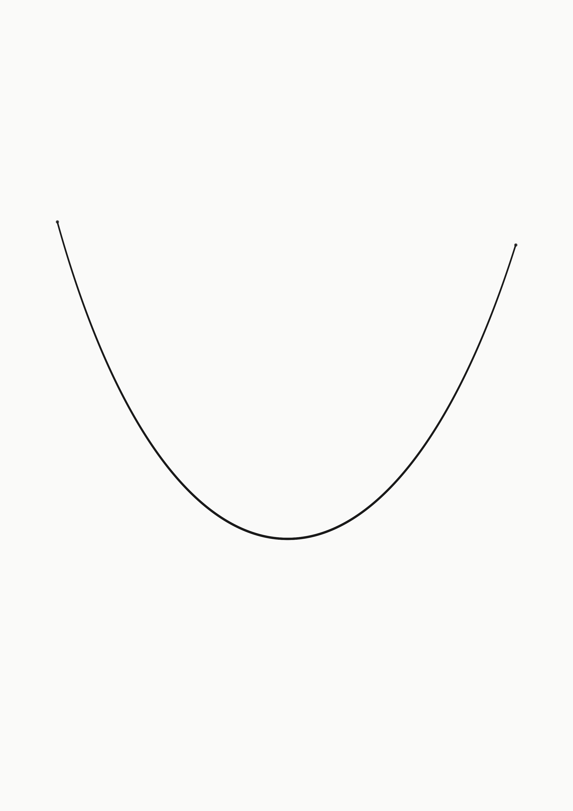
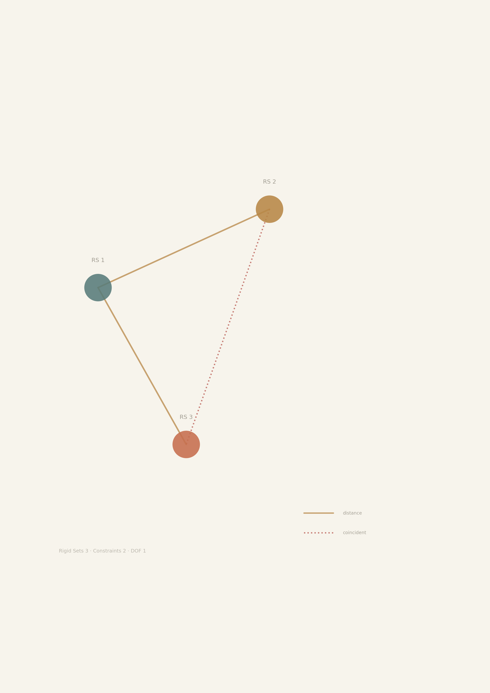

# Aesthetic Taste — A Single Curve

Date: 2026-05-27
Status: seed
Narrative line: UI/viewer/scientific figures (Arc 2: Evidence Workbench)

## Intent

When we say "quiet technical atelier," what does that taste look like on a blank
page? This is a one-image answer: an A4 sheet of warm white paper with a single
Bézier curve.

It is not a diagram, not a figure, not a UI mockup. It is a taste sample — a
calibration target for the kind of visual restraint the GCS viewer and figure
pipeline aim for.

## Composition

| Element | Decision |
| --- | --- |
| Canvas | A4 proportion (1:√2), warm white (#FAFAF9) |
| Curve | Single cubic Bézier, asymmetric arc, dark gray (#1A1A1A) |
| Line weight | Tapered — thicker at mid-stroke, thinning toward endpoints |
| Endpoints | Two small dots marking the start and end of stroke |
| Margin | Generous, unadorned white space |
| Total element count | 1 curve + 2 dots = 3 |

## Aesthetic Position

1. **Restraint over accumulation.** Adding a second curve would weaken the first.
   The page earns its presence not by filling space but by leaving it.

2. **Warmth without nostalgia.** The off-white paper (#FAFAF9) is slightly warm —
   closer to cotton paper than to screen-white (#FFFFFF). The curve is dark gray
   (#1A1A1A), not pure black. Both choices reduce glare and invite sustained
   looking.

3. **Asymmetry over symmetry.** The curve enters low-left, dips shallowly, rises
   high-right. It is balanced but not mirrored. Symmetry would read as
   decoration; asymmetry reads as motion.

4. **Tapered stroke.** The line breathes — thicker where it carries momentum,
   thinner where it begins and ends. This is the difference between a plotted
   function and a drawn thought.

5. **Evidence, not ornament.** There is no grid, no label, no legend, no
   border. The image trusts the viewer to see the curve and the paper together,
   without explanation.

## Relationship to GCS Visual Language

This image is the zero-reference for the GCS "Quiet Technical Atelier" thesis
(`docs/architecture/72-ui-aesthetic-roadmap.md`). It is the answer to: "before
we put solver evidence on screen, what does our taste look like on an empty
page?"

Future viewer and figure work should be able to place itself on a continuum
from this image:

- closer to this → quiet, deliberate, evidence-first
- farther from this → noisy, decorative, surface-first

## Generation

```
python docs/research/20260527/aesthetic-taste/generate.py
```

Output: `elegant_curve_a4.png` (A4, 300 DPI, 2480×3508 px)

Dependencies: matplotlib, numpy

## Image



## Bridge: Constraint Graph on A4



The bridge image translates the same aesthetic position into a minimal
geometric constraint graph: 3 rigid sets, 2 constraint types (distance and
coincident), rendered in the GCS palette from `python/gcs_viz/color_scheme.py`.

Where the single curve answers "what does our taste look like on a blank
page?", the bridge answers "what does our taste look like with solver
evidence on the page?"

**Generation:**
```
python docs/research/20260527/aesthetic-taste/bridge_constraint_graph.py
```

**GCS tokens used:**
- Paper: `surface.paper` (#F7F4EC)
- Rigid sets: `rigidSet.palette.01` (#587C7A), `.02` (#B88746), `.05` (#C66E4E)
- Constraints: `constraint.type.distance.color` (#B88746), `.coincident.color` (#B8574E)
- Labels: `text.muted` (#8B867A)
- Line styles: `constraint.type.distance.lineStyle` (solid), `.coincident.lineStyle` (dotted)
